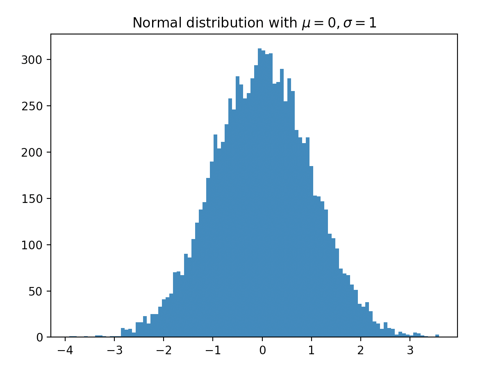

[Principal](../README.md) 
[Api_Post](READMEPOST.md) | [Api_Get](READMEGET.md)  | [Tuplas](READMETupleSet.md) | [Listas](READMELIST.md) | [Diccionarios](READMEDIC.md) | [Selenium](../Selenium/README.md)

Documentación Numpy: <https://numpy.org/doc/> 
Documentación Matplot: <http://www.aosabook.org/en/matplotlib.html> 

# Numpy
Es una biblioteca para crear vectores y matrices grandes multidimensionales, junto con una gran colección de funciones matemáticas de alto nivel para operar con ellas.

# Matplot:
la historia de Matplotlib y su arquitectura. Matplotlib es uno de los más utilizados, si no la biblioteca de visualización de datos más popular en Python. Fue creado por John Hunter, quien era neurobiólogo y era parte de un equipo de investigación que estaba trabajando en el análisis de las señales de electrocorticografía, ECoG para abreviar. El equipo estaba usando un software propietario para análisis. Sin embargo, solo tenían una licencia y se turnaban para usarla. Entonces, para superar esta limitación, John se propuso reemplazar el software propietario con una versión basada en MATLAB que podría ser utilizada por él y sus compañeros de equipo, y eso podría ser extendido por múltiples investigadores. Como resultado, Matplotlib se desarrolló originalmente como una herramienta de visualización ECoG, y al igual que MATLAB, Matplotlib estaba equipado con una interfaz de scripting para la generación de gráficos rápida y fácil, representada por pyplot. 

Demo:
-----

    # importamos figurecanvas
    from matplotlib.backends.backend_agg import FigureCanvasAgg as FigureCanvas
    # importamos Figure artist
    from matplotlib.figure import Figure

    fig = Figure()
    canvas = FigureCanvas(fig)

    # creamos un random de 10000 numeros usando numpy
    import numpy as np

    x = np.random.randn(10000)
    # creamos axes artist (1 columna, 1 fila 1º celda)
    ax = fig.add_subplot(111)
    # creamos histograma de 10000 numeros
    ax.hist(x, 100)
    # añadimos el titulo y la salvamos
    ax.set_title('Normal distribution with $\mu=0, \sigma=1$')
    fig.savefig('matplotlib_histogram.png')
    
Demo simnplificado:
-------------------

    import matplotlib.pyplot as plt
    import numpy as np
    
    x = np.random.randn(10000)
    plt.hist(x,100)
    plt.title('Normal distribution with $\mu=0, \sigma=1$')
    plt.savefig('matplotlib_histogrampng)
    plt.show()

### Instalar Jupiter, matploitlib
- pip3 install jupyter 
- pip3 install matplotlib
- python3 -mpip install -U matplotlib
- python3 -mpip install -U matplotlib

### Importar numpy:
    import numpy as np

### Convertir una lista a un arreglo numpy:
    a=np.array([1,2,3,4,5])
    
### type(), obtiene el tipo <numpy.ndarray>:
    print("El tipo es: ", type(a))
    
### dtype, obtener el tipo de datos del arreglo:
    print("los datos son de tipo: ", a.dtype)
    
### mean(), obtener la media del arreglo:
    mean_a = a.mean()
    print("la media de los datos del arreglo es:", mean_a)
  
## CREAR y TRAZAR FUNCIONES:
### Importar librería:
    import matplotlib.pyplot as plt
    
### crear un vector con cuatro puntos equidistanciados, desde 0 hasta 2:
    np.linspace(0, 2, 4)

### crear la funcion y=sin(x)+2 , uando la matriz numpy x
    x = np.linspace(0.2 * np.pi, 100)
    y = np.sin(x)
    
### matplotlib.pylot, Trazar la solucion:
    plt.plot(x, y)
    plt.show()
