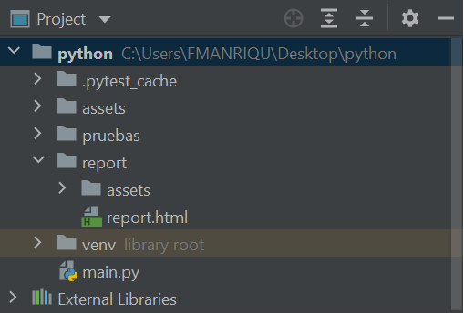
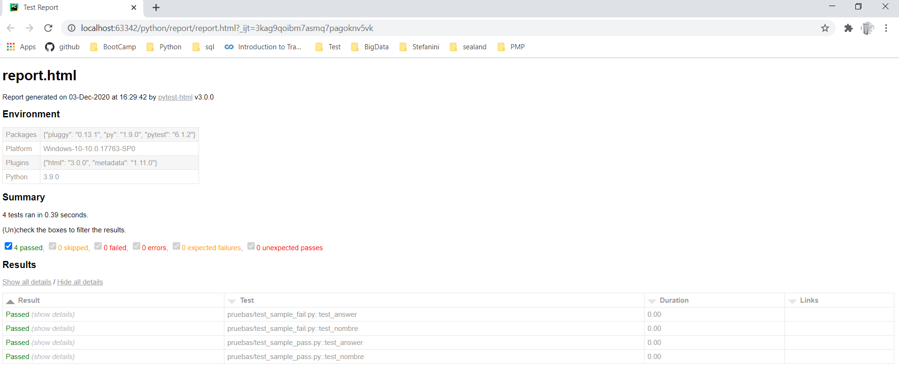

[Principal](../README.md) 

# PyTest
pytestes un marco que facilita la creación de pruebas simples y escalables. Las pruebas son expresivas y legibles, no se requiere un código estándar. Comience en minutos con una prueba de unidad pequeña o una prueba funcional compleja para su aplicación o biblioteca.

#### Instalar pytest
  
    pip install -U pytest

#### Compruebe que instaló la versión correcta:

    $ pytest --version

#### Cree una función de prueba simple con solo cuatro líneas de código:
*test_sample_fail.py
  
    def func(x):
    return x + 1

    def nombre(name):
    return name

    def test_answer():
    assert func(3) == 5

    def test_nombre():
    assert nombre('Fernando') == 'pepe'
      
**Nota:** esta prueba fallará dado que 3+1 no son 5 y pepe no es igual a 'Fernando'

#### Cree una función de prueba simple con solo cuatro líneas de código:
test_sample_pass.py
  
    def func(x):
    return x + 1

    def nombre(name):
    return name

    def test_answer():
    assert func(4) == 5

    def test_nombre():
    assert nombre('Fernando') == 'Fernando'
  
**Nota:** esta prueba pasará dado que 4+1 no son 5 y 'Fernando' es igual a 'Fernando'

### EJECUCIONES

1. **Ejecutar todas las pruebas**
        
       a) pytest
       b) pytest -ra
       c) python -m pytest
       
2. **Hacer que pare al primer fallo**
  
        Pytest -x
  
3. **hacer que para el n fallo**
 
        Pytest --maxfail=2
    
**NOTA:** En este caso para cuando encuentre el segundo fallo
    
4. **Ejecutar las pruebas de un fichero**
* **sintax:** pytest [path_al_file.py]
    
      pytest pruebas/test_sample_pass.py
     
* **OutPut** 
    =========================== test session starts ============================ 
    platform win32 -- Python 3.9.0, pytest-6.1.2, py-1.9.0, pluggy-0.13.1 
    rootdir: C:\Users\FMANRIQU\Desktop\python 
    collected 2 item                                                                                                                                                    
    pruebas\test_sample.py .                                             [100%] 
    ============================ 2 passed in 0.03s ============================ 

5. **Ejecutar pruebas en un directorio**
* **sintax:** pytest [path_al_directorio]

      pytest pruebas/

* **OutPut** 
    ====================== test session starts ========================== 
    platform win32 -- Python 3.9.0, pytest-6.1.2, py-1.9.0, pluggy-0.13.1 
    rootdir: C:\Users\FMANRIQU\Desktop\python 
    collected 4 items                                                                                                                                                   
    pruebas\test_sample_fail.py FF                               [ 50%] 
    pruebas\test_sample_pass.py ..                               [100%] 
    ============================ FAILURES ========================== 
    ____________________________ test_answer ___________________________ 

    *def test_answer(): 
    *>   assert func(3) == 5 
    *E   assert 4 == 5 
    *E    +  where 4 = func(3) 
    *pruebas\test_sample_fail.py:8: AssertionError 
    ____________________________ test_nombre ____________________________ 

    *def test_nombre(): 
    *>    assert nombre('Fernando') == 'Pepe' 
    *E    AssertionError: assert 'Fernando' == 'Pepe' 
    *E     - Pepe 
    *E         + Fernando 
    *pruebas\test_sample_fail.py:11: AssertionError 
    ====================== short test summary info ========================== 
    *FAILED pruebas/test_sample_fail.py::test_answer - assert 4 == 5 
    *FAILED pruebas/test_sample_fail.py::test_nombre - AssertionError: assert 'Fernando' == 'Pepe' 
    ====================== 2 failed, 2 passed in 0.10s ========================= 

6. **Ejecutar un test específico de un fichero**
* **sintax:** pytest [path_al_file.py]::[test_a_ejecutar]

      pytest pruebas/test_sample_pass.py::test_nombre

* **OutPut** 
    ====================== test session starts ============================ 
    platform win32 -- Python 3.9.0, pytest-6.1.2, py-1.9.0, pluggy-0.13.1 
    rootdir: C:\Users\FMANRIQU\Desktop\python 
    collected 1 item                                                                                                                                                        
    pruebas\test_sample_pass.py .                                    [100%] 
    ========================== 1 passed in 0.02s ========================== 

**Nota:** tambien se podría realizar una ejecución de una fucnion en concreto de una clase:

    pytest test_mod.py::TestClass::test_method
    
7. **Llamar a pytest en código Python**
* **sintax:** pytest.main()
test_sample_pass.py
  
    def func(x):
    return x + 1

    def nombre(name):
    return name

    def test_answer():
    assert func(4) == 5

    def test_nombre():
    assert nombre('Fernando') == 'Fernando'
    
    pytest.main()

* **Output:** 
    ============================= test session starts ============================= 
    platform win32 -- Python 3.9.0, pytest-6.1.2, py-1.9.0, pluggy-0.13.1 
    rootdir: C:\Users\FMANRIQU\Desktop\python\pruebas, configfile: pytest.ini 
    collected 4 items 
    test_sample_fail.py FF                                                   [ 50%] 
    test_sample_pass.py ..                                                   [100%] 
    ================================== FAILURES ============================= 
    _________________________________ test_answer _________________________________ 

    *def test_answer(): 
    *>       assert func(5) == 5 
    *E       assert 6 == 5 
    *E        +  where 6 = func(5) 
    *test_sample_fail.py:11: AssertionError 
    _________________________________ test_nombre _________________________________ 

    *def test_nombre(): 
    *>       assert nombre('Fernando') == 'fer' 
    *E       AssertionError: assert 'Fernando' == 'fer' 
    *E         - fer 
    *E         + Fernando 
    *test_sample_fail.py:14: AssertionError 
    =========================== short test summary info ======================== 
    *FAILED test_sample_fail.py::test_answer - assert 6 == 5 
    *FAILED test_sample_fail.py::test_nombre - AssertionError: assert 'Fernando' =... 
    ========================= 2 failed, 2 passed in 0.42s ========================= 

### REPORTE 
## XML
1. **Ejecutar reporte en xml**

        pytest --junitxml=pruebas/report
 
 ## URL
1. **Cree un enlace de URL de registro para cada caso de uso de falla de prueba**
    
        pytest --pastebin=failed
 
2. **Cree un enlace URL para todo el registro de ejecución de la prueba**

        pytest --pastebin=all
 
 ## HTML
 1. **Instalar pytest-html**

        pip install pytest-html
     
 2. **Generar directorio report**
 

        
 3. **Correr test**

        pytest --html=report.html

**NOTA:** Al ejecutar las pruebas, nos generará un reporte Html como figura abajo, o mejor sería crear un directorio en la raiz que ponga report y dirrigir todos los reports a dicho directorio.

    pytest --html=report/report.html

 
      

[Subir](#top)
