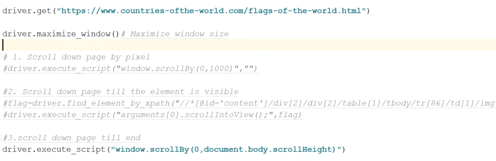

[Principal](../README.md) 

# Documentación:
> https://selenium-python.readthedocs.io/ 
> https://www.selenium.dev/documentation/es/

# Instalar Selenium con brew: 
    brew install selenium-server-standalone

# Drivers: 
    Chrome:	https://sites.google.com/a/chromium.org/chromedriver/downloads
    Edge:	https://developer.microsoft.com/en-us/microsoft-edge/tools/webdriver/
    Firefox:	https://github.com/mozilla/geckodriver/releases
    Safari:	https://webkit.org/blog/6900/webdriver-support-in-safari-10/

# Ejemplo de uso: 
    from selenium.webdriver import Chrome

    driver = Chrome()
    Chrome(executable_path='/usr/local/bin/chromedriver')
    driver.get("https://selenium.dev")
    driver.maximize_window()

## Click de un elemento: 
    driver.find_element(By.CSS_SELECTOR, "input[type='submit']").click()

## Localizar elemento By Name, escribir y pulsar enter 
    driver.find_element(By.NAME, "q").send_keys("cheese" + Keys.RETURN)

## Navegar hacia una url: 
    driver.get("https://selenium.dev")

## Obtener la url actual: 
    driver.current_url

## Obtener el title: 
    driver.title

## Retroceder: 
    driver.back()

## Avanzar: 
    driver.forward()

## Actualizar: 
    driver.refresh()

## Localizar elemento By Id: 
    driver.find_element(By.ID, "cheese")
    usernameField = driver.find_element(By.ID, "username")
    usernameField.clear();
    username.sendKeys("Fernando")
    passwordField = driver.find_element(By.ID, "password")
    passwordField.claer();
    password.sendkeys("*******")

## Localizar By Css_selector, por ejemplo en una lista: 
    driver.find_element_by_css_selector("#cheese #cheddar")

## Localizar todos los elementos de la lista: 
    driver.find_elements_by_css_selector("#cheese li")

# Frames e Iframes: 
Ejemplon HTML: 
--------------
     

       <iframe id="buttonframe" name="myframe"  src="https://seleniumhq.github.io">
           <button>Click here</button>
       </iframe>
     

Usando el ID 
------------
    driver.switch_to.frame('buttonframe')

Ahora podemos hacer clic en el botón 
------------------------------------
    driver.find_element(By.TAG_NAME, 'button').click()

## salir del iframe: 
    driver.switch_to.default_content()

# Esperas 
Espara hasta que se cumpla una condición: 
-----------------------------------------
    wait.until(some_condition)

> Haz clic en el enlace para activar la alerta: 

    driver.find_element(By.LINK_TEXT, "See an example alert").click()

>  Espera a que se muestre la alerta y almacenala en una variable: 
    
    alert = wait.until(expected_conditions.alert_is_present())

> Almacena el texto de la alerta en una variable: 

    text = alert.text

> Presiona el botón OK: 

    alert.accept()
    
# Formas de hacer scroll:

# Espera Implicita: 
    driver.implicitly_wait(10)

# Salir del navegador al final de una sesión: 
    driver.quit()
[Subir](#top)
