
[Principal](../README.md) 

[Documentación]<https://www.interactivechaos.com/python/function/traintestsplit>

*[scikit-learn -> regresión lineal simple](#linealsimple)* 
*[scikit-learn -> regresión lineal multiple](#multiple)* 
*[scikit-learn -> regresión polinómica](#polinomica)* 
*[scikit-learn -> regresión no lineal](#noLineal)* 

# Librería scikit-learn para implementar regresión lineal simple:
Descargaremos un set de datos relacionado al consumo de combustible y a la emisión del dióxido de Carbono en autos.  Luego, separaremos nuestros datos en un set de entrenamiento y en otro set de prueba, crearemos un modelo utilizando un set de entrenamiento, se evaluará utilizando el set de prueba para finalmente usar el modelo para predecir valores desconocidos
### Importando paquetes Necesarios:

    import matplotlib.pyplot as plt
    from sklearn import linear_model
    from sklearn.metrics import r2_score
    import pandas as pd
    import pylab as pl
    import numpy as np
    import wget as wget

### Descargando los Datos:
Para descargar los datos, usaremos !wget desde IBM Object Storage.
    
    url = 'https://s3-api.us-geo.objectstorage.softlayer.net/cf-courses-data/CognitiveClass/ML0101ENv3/labs/FuelConsumptionCo2.csv'
    wget.download(url, 'FuelConsumption.csv')

¿Sabías? Cuando se trata de Machine Learning, seguro trabajarás con grandes datasets (juego de datos). Entonces, ¿dónde podrás guardar esos datos? IBM ofrece una oportunidad única para las empresas, con 10 Tb de IBM Cloud Object Storage: Sign up now for free

##### Understanding the Data
FuelConsumption.csv:
Hemos descargado el dataset de consumo de combustible, FuelConsumption.csv, el cual contiene ratings específicos al consumo de combustible y emisiones de dióxido de carbono para aquellos vehículos ligeros en la venta minorista dentro de Canadá. Dataset source

    MODELYEAR e.g. 2014
    MAKE e.g. Acura
    MODEL e.g. ILX
    VEHICLE CLASS e.g. SUV
    ENGINE SIZE e.g. 4.7
    CYLINDERS e.g 6
    TRANSMISSION e.g. A6
    FUEL CONSUMPTION in CITY(L/100 km) e.g. 9.9
    FUEL CONSUMPTION in HWY (L/100 km) e.g. 8.9
    FUEL CONSUMPTION COMB (L/100 km) e.g. 9.2
    CO2 EMISSIONS (g/km) e.g. 182 --> low --> 0
   
### Leyendo los datos:
    df = pd.read_csv("FuelConsumption.csv")
    # un vistazo dentro del set de datos
    print(df.head())
    
### Exploración de Datos:
    # Tengamos primero una exploración descriptiva de nuestros datos.
    # Sumarizar los datos
    print(df.describe())
    
### Seleccionemos algunas características para explorar más en detalle:
    cdf = df[['ENGINESIZE','CYLINDERS','FUELCONSUMPTION_COMB','CO2EMISSIONS']]
    print(cdf.head(9))
    
### podemos dibujar cada una de estas características:
    print(cdf.hist())
    print(plt.show())
   
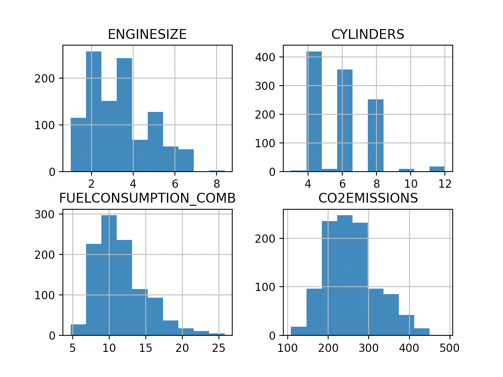
    
### Ahora, comparemos estas características anteriores con la emisión de carbono, para ver cuán lineal es la regresión:
    plt.scatter(cdf.FUELCONSUMPTION_COMB, cdf.CO2EMISSIONS,  color='blue')
    plt.xlabel("FUELCONSUMPTION_COMB")
    plt.ylabel("Emission")
    print(plt.show())
    
    plt.scatter(cdf.ENGINESIZE, cdf.CO2EMISSIONS,  color='blue')
    plt.xlabel("Engine size")
    print(plt.ylabel("Emission"))
    plt.show()
    
    
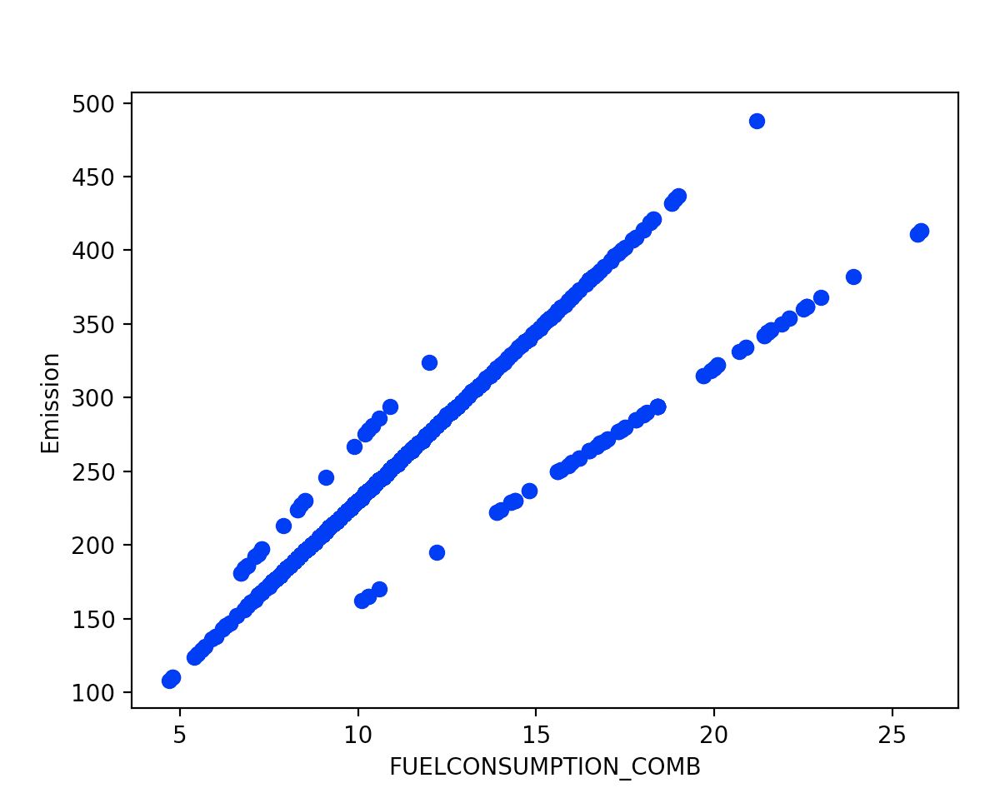
    
## Creando el set de datos de entrenamiento y de el prueba:
Train/Test Split divide el dataseet en uno de entrenamiento y otro de pruebas, siendo excluyentes. Después de ello, entrenas con el set de entrenamiento y pruebas con el de prueba. 
Esto brinda una evaluación más exacta porque el set de entrenamiento no es parte de un set de datos que se usaron para entrenar datos. Refleja un escenario más real basado en problemas más actuales.
Esto significa que sabemos la salida de cada punto de datos del set, siendo un escenario ideal Y como estos datos no se usaron para entrenar el modelo, el modelo no sabe la salida de estos puntos de datos. Asi que, básicamente, es una prueba real fuera de muestra.

    msk = np.random.rand(len(df)) < 0.8
    train = cdf[msk]
    test = cdf[~msk]
    
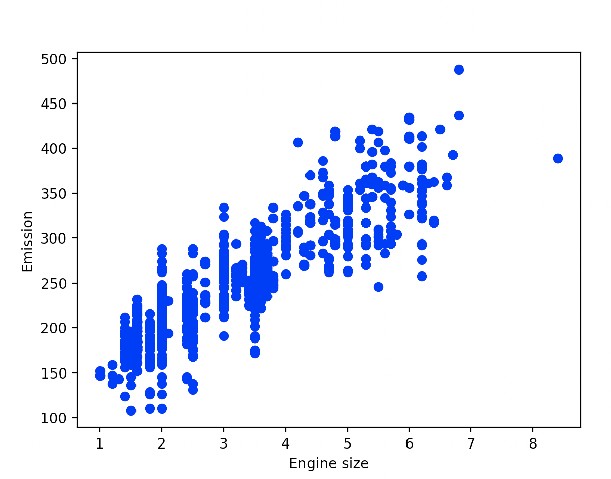
    
## Modelo de Regresión Simple:
La Regresión Lineal cuadra con un modelo lineal de coeficientes B = (B1, ..., Bn) para minimizar la 'suma residual de cuadrados' entre la x independiente del dataset y la dependiente y por la aproximación lineal.

### Entrenar distribución de los datos:
    plt.scatter(train.ENGINESIZE, train.CO2EMISSIONS,  color='blue')
    plt.xlabel("Engine size")
    plt.ylabel("Emission")
    plt.show()
    

## Modeling
Usando el paquete sklearn para modelar datos:
    
    regr = linear_model.LinearRegression()
    train_x = np.asanyarray(train[['ENGINESIZE']])
    train_y = np.asanyarray(train[['CO2EMISSIONS']])
    regr.fit (train_x, train_y)
    # The coefficients
    print ('Coefficients: ', regr.coef_)
    print ('Intercept: ',regr.intercept_)
    

son los parámetros de la recta de ajuste. 
Dado que es una regresión lineal simple, con 2 parámetros solamente, y sabiendo que los parámetros son la intersección y pendiente de la linea, sklearn puede estimarlas directamente a partir de los datos. 
Tener en cuenta que todos los datos deben estar disponibles para poder calcular los parámetros.

## Trazar las salidas
### podemos marcar la recta de ajuste sobre los datos:
    plt.scatter(train.ENGINESIZE, train.CO2EMISSIONS,  color='blue')
    plt.plot(train_x, regr.coef_[0][0]*train_x + regr.intercept_[0], '-r')
    plt.xlabel("Engine size")
    plt.ylabel("Emission")
    
## Evaluación:
comparamos los valores actuales y predichos para calcular la exactitud del modelo de regresión. Las métricas de la evaluación proveen un role principal en el #### desarrollo de un modelo, ya que provee conocimiento profundo en areas que necesitan mejoras.

    test_x = np.asanyarray(test[['ENGINESIZE']])
    test_y = np.asanyarray(test[['CO2EMISSIONS']])
    test_y_ = regr.predict(test_x)

    print("Error medio absoluto: %.2f" % np.mean(np.absolute(test_y_ - test_y)))
    print("Suma residual de los cuadrados (MSE): %.2f" % np.mean((test_y_ - test_y) ** 2))
    print("R2-score: %.2f" % r2_score(test_y_ , test_y) )

*[scikit-learn -> regresión lineal simple](#linealsimple)* 
*[scikit-learn -> regresión lineal multiple](#multiple)* 
*[scikit-learn -> regresión polinómica](#polinomica)* 
*[scikit-learn -> regresión no lineal](#noLineal)* 

# Librería scikit-learn para implementar regresión lineal multiple:
### Importando paquetes Necesarios:

    import matplotlib.pyplot as plt
    from sklearn import linear_model
    import pandas as pd
    import numpy as np
    import wget as wget

### Descargando los Datos:
Para descargar los datos, usaremos !wget desde IBM Object Storage.
    
    url = 'https://s3-api.us-geo.objectstorage.softlayer.net/cf-courses-data/CognitiveClass/ML0101ENv3/labs/FuelConsumptionCo2.csv'
    wget.download(url, 'FuelConsumption.csv')

¿Sabías? Cuando se trata de Machine Learning, seguro trabajarás con grandes datasets (juego de datos). Entonces, ¿dónde podrás guardar esos datos? IBM ofrece una oportunidad única para las empresas, con 10 Tb de IBM Cloud Object Storage: Sign up now for free

##### Understanding the Data
FuelConsumption.csv:
Hemos descargado el dataset de consumo de combustible, FuelConsumption.csv, el cual contiene ratings específicos al consumo de combustible y emisiones de dióxido de carbono para aquellos vehículos ligeros en la venta minorista dentro de Canadá. Dataset source

    MODELYEAR e.g. 2014
    MAKE e.g. Acura
    MODEL e.g. ILX
    VEHICLE CLASS e.g. SUV
    ENGINE SIZE e.g. 4.7
    CYLINDERS e.g 6
    TRANSMISSION e.g. A6
    FUEL CONSUMPTION in CITY(L/100 km) e.g. 9.9
    FUEL CONSUMPTION in HWY (L/100 km) e.g. 8.9
    FUEL CONSUMPTION COMB (L/100 km) e.g. 9.2
    CO2 EMISSIONS (g/km) e.g. 182 --> low --> 0
   
### Leyendo los datos:
    df = pd.read_csv("FuelConsumption.csv")
    # un vistazo dentro del set de datos
    print(df.head())
    
### Seleccionemos algunas características:
    cdf = df[['ENGINESIZE','CYLINDERS','FUELCONSUMPTION_CITY','FUELCONSUMPTION_HWY','FUELCONSUMPTION_COMB','CO2EMISSIONS']]
    print(cdf.head(9))
    
### Tracemos los valores de las emisiones con respecto al tamaño del motor:
    plt.scatter(cdf.ENGINESIZE, cdf.CO2EMISSIONS,  color='blue')
    plt.xlabel("Engine size")
    plt.ylabel("Emission")
    print(plt.show())
    
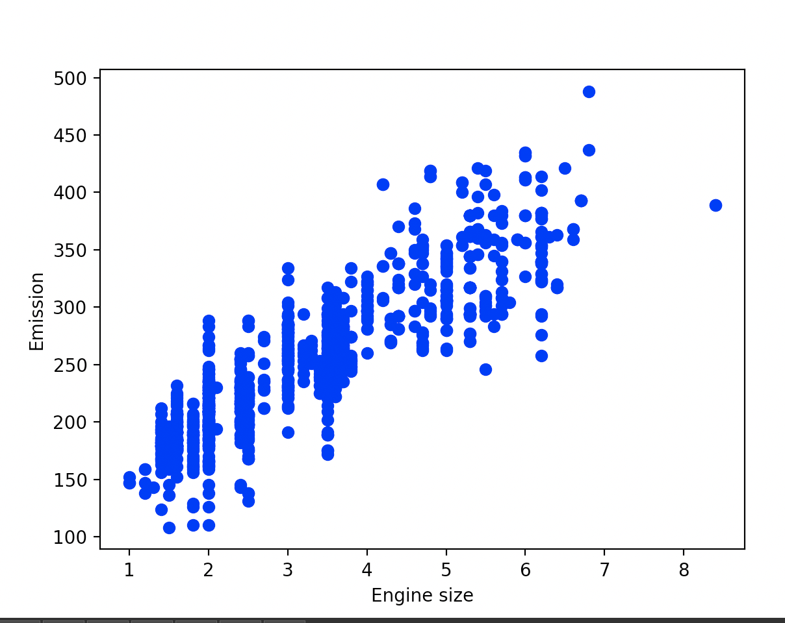

## Creating train and test dataset
La división tren/prueba implica dividir el conjunto de datos en conjuntos de formación y de pruebas respectivamente, que son mutuamente excluyentes. Después de lo cual, usted entrena con el equipo de entrenamiento y prueba con el equipo de prueba. Esto proporcionará una evaluación más precisa de la precisión fuera de la muestra, ya que el conjunto de datos de la prueba no forma parte del conjunto de datos que se ha utilizado para entrenar los datos. Es más realista para los problemas del mundo real.
    
    msk = np.random.rand(len(df)) < 0.8
    train = cdf[msk]
    test = cdf[~msk]
    
#### Train data distribution
    plt.scatter(train.ENGINESIZE, train.CO2EMISSIONS,  color='blue')
    plt.xlabel("Engine size")
    plt.ylabel("Emission")
    print(plt.show())
    
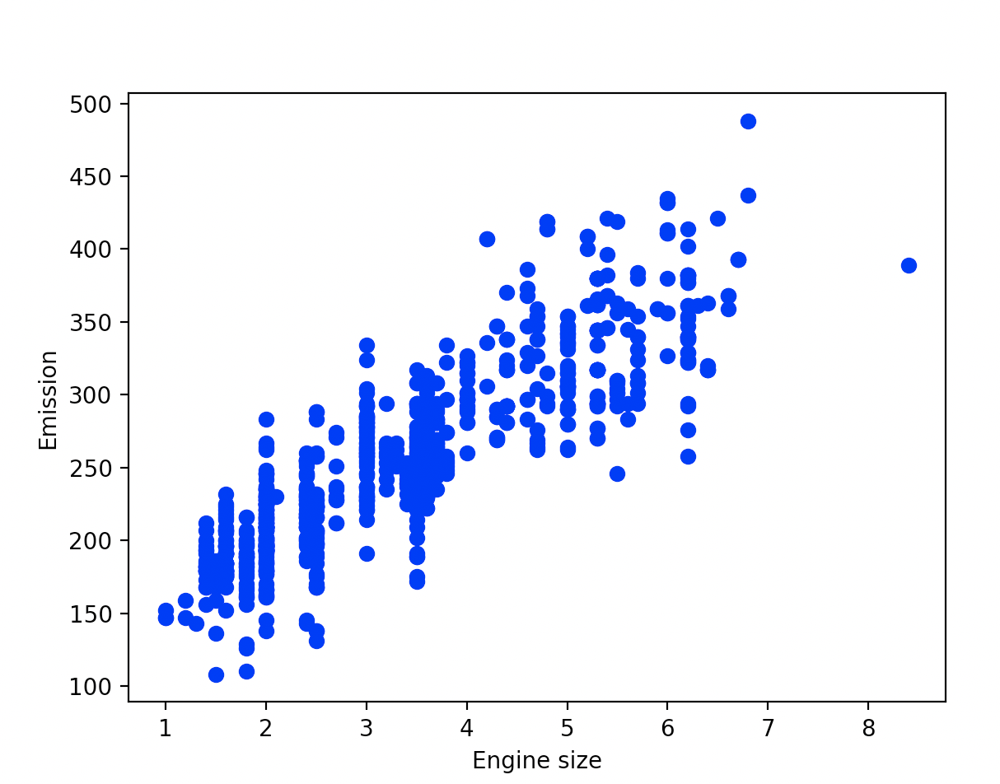
    
## Multiple Regression Model: 
Cuando hay más de una variable independiente presente, el proceso se denomina regresión lineal múltiple. Lo bueno aquí es que la regresión lineal múltiple es la extensión del modelo de regresión lineal simple.
    
    regr = linear_model.LinearRegression()
    x = np.asanyarray(train[['ENGINESIZE','CYLINDERS','FUELCONSUMPTION_COMB']])
    y = np.asanyarray(train[['CO2EMISSIONS']])
    regr.fit (x, y)
    # The coefficients
    print ('Coefficients: ', regr.coef_)

## Ordinary Least Squares (OLS)
OLS es un método para estimar los parámetros desconocidos en un modelo de regresión lineal. OLS elige los parámetros de una función lineal de un conjunto de variables explicativas minimizando la suma de los cuadrados de las diferencias entre la variable objetivo dependiente y las previstas por la función lineal. En otras palabras, intenta minimizar la suma de errores cuadrados (SSE) o el error cuadrado medio (MSE) entre la variable objetivo (y) y nuestro resultado previsto ( ℎ𝑎𝑡ℎ𝑎𝑡𝑦 ) en todas las muestras del conjunto de datos.

OLS puede encontrar los mejores parámetros usando los siguientes métodos: 
- Resolución analítica de los parámetros del modelo mediante ecuaciones de forma cerrada 
- Utilizando un algoritmo de optimización (Descenso de Gradiente, Descenso de Gradiente Estocástico, Método de Newton, etc.)

#### Prediction:
    y_hat= regr.predict(test[['ENGINESIZE','CYLINDERS','FUELCONSUMPTION_COMB']])
    x = np.asanyarray(test[['ENGINESIZE','CYLINDERS','FUELCONSUMPTION_COMB']])
    y = np.asanyarray(test[['CO2EMISSIONS']])
    print("Residual sum of squares: %.2f"
      % np.mean((y_hat - y) ** 2))

    # Explained variance score: 1 is perfect prediction
    print('Variance score: %.2f' % regr.score(x, y))

*[scikit-learn -> regresión lineal simple](#linealsimple)* 
*[scikit-learn -> regresión lineal multiple](#multiple)* 
*[scikit-learn -> regresión polinómica](#polinomica)* 
*[scikit-learn -> regresión no lineal](#noLineal)* 

## Regresión polinómica:
Implementar una Regresión Polinómica. Descargaremos un set de datos relacionado al consumo de combustible y a la emisión del dióxido de Carbono en autos. Luego, separaremos nuestros datos en un set de entrenamiento y en otro set de prueba, crearemos un modelo utilizando un set de entrenamiento, se evaluará utilizando el set de prueba para finalmente usar el modelo para predecir valores desconocidos

### Importando los paquetes necesarios:
   
    import matplotlib.pyplot as plt
    from sklearn import linear_model
    from sklearn.metrics import r2_score
    import pandas as pd
    import pylab as pl
    import numpy as np
    import wget as wget

### Descargando los Datos:
Para descargar los datos, usaremos !wget desde IBM Object Storage.
    
    url = 'https://s3-api.us-geo.objectstorage.softlayer.net/cf-courses-data/CognitiveClass/ML0101ENv3/labs/FuelConsumptionCo2.csv'
    wget.download(url, 'FuelConsumption.csv')

¿Sabías? Cuando se trata de Machine Learning, seguro trabajarás con grandes datasets (juego de datos). Entonces, ¿dónde podrás guardar esos datos? IBM ofrece una oportunidad única para las empresas, con 10 Tb de IBM Cloud Object Storage: Sign up now for free

##### Understanding the Data
FuelConsumption.csv:
Hemos descargado el dataset de consumo de combustible, FuelConsumption.csv, el cual contiene ratings específicos al consumo de combustible y emisiones de dióxido de carbono para aquellos vehículos ligeros en la venta minorista dentro de Canadá. Dataset source

    MODELYEAR e.g. 2014
    MAKE e.g. Acura
    MODEL e.g. ILX
    VEHICLE CLASS e.g. SUV
    ENGINE SIZE e.g. 4.7
    CYLINDERS e.g 6
    TRANSMISSION e.g. A6
    FUEL CONSUMPTION in CITY(L/100 km) e.g. 9.9
    FUEL CONSUMPTION in HWY (L/100 km) e.g. 8.9
    FUEL CONSUMPTION COMB (L/100 km) e.g. 9.2
    CO2 EMISSIONS (g/km) e.g. 182 --> low --> 0
   
### Leyendo los datos:
    df = pd.read_csv("FuelConsumption.csv")
    # un vistazo dentro del set de datos
    print(df.head())

### Seleccionemos algunas caracaterísticas para usar en la regresión:
    cdf = df[['ENGINESIZE','CYLINDERS','FUELCONSUMPTION_COMB','CO2EMISSIONS']]
    print(cdf.head(9))
    
### Grafiquemos los valores de emisión respecto al tamaño del motor:
    plt.scatter(cdf.ENGINESIZE, cdf.CO2EMISSIONS,  color='blue')
    plt.xlabel("Engine size")
    plt.ylabel("Emission")
    print(plt.show())
    
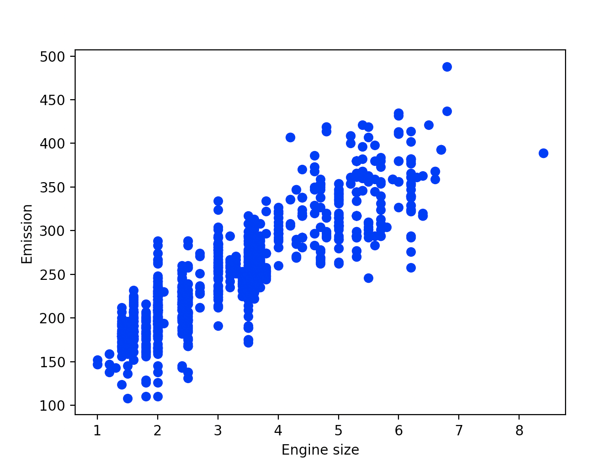
    
### Crear conjunto de datos de entrenamiento y pruebas:
Hay que dividir el conjunto en dos, el de entrenamiento y el de pruebas, los cuales son mutuamente excluyentes. Despues de hacerlo, deberá entrenar con el conjunto de entrenamiento y hacer pruebas con el conjunto de pruebas.
    
    msk = np.random.rand(len(df)) < 0.8
    train = cdf[msk]
    test = cdf[~msk]

## Regresión Polinómica:
En ocasiones la tendencia de los datos no es lineal si no que tiene una apariencia curva. Para estos caso podemos usar los métodos de Regresión Polinómica. De hecho, existen diversos tipos de regresión que pueden ser usados para ajustarse de acuerdo a la apariencia de los datos, como puede ser la regresión cuadratica, cúbica, etc. Puede haber tantos tipos de regresiones como grados en un polinomio.

La función PloynomialFeatures() de la librería Scikit-learn maneja un nuevo conjunto de características del conjunto original.

    train_x = np.asanyarray(train[['ENGINESIZE']])
    train_y = np.asanyarray(train[['CO2EMISSIONS']])

    test_x = np.asanyarray(test[['ENGINESIZE']])
    test_y = np.asanyarray(test[['CO2EMISSIONS']])

    poly = PolynomialFeatures(degree=2)
    #fit_transform toma los valores de x e imprime una lista de los datos que van desde la magnitud 0 a la 2 (ya que hemos seleccionado que nuestro polinómio   sea de segundo grado).
    train_x_poly = poly.fit_transform(train_x)
    print(train_x_poly)

Ahora podemos manejar el problema como si se tratara de una 'regresión lineal'. Por lo tanto, esta regresión polinomica se considera como un caso especial de regresión lineal múltiple. Puede utilizar la misma mecánica para resolver dicho problema.

### Usemos la función LinearRegression() para resolver:
    clf = linear_model.LinearRegression()
    train_y_ = clf.fit(train_x_poly, train_y)
    # los coeficientes 
    print ('Coefficients: ', clf.coef_)
    print ('Intercept: ',clf.intercept_)

### Grafiquemoslo:
    plt.scatter(train.ENGINESIZE, train.CO2EMISSIONS,  color='blue')
    XX = np.arange(0.0, 10.0, 0.1)
    yy = clf.intercept_[0]+ clf.coef_[0][1]*XX+ clf.coef_[0][2]*np.power(XX, 2)
    plt.plot(XX, yy, '-r' )
    plt.xlabel("Engine size")
    plt.ylabel("Emission")
    print(plt.show())
    

### Evaluación:
    test_x_poly = poly.fit_transform(test_x)
    test_y_ = clf.predict(test_x_poly)

    print("Mean absolute error: %.2f" % np.mean(np.absolute(test_y_ - test_y)))
    print("Residual sum of squares (MSE): %.2f" % np.mean((test_y_ - test_y) ** 2))
    print("R2-score: %.2f" % r2_score(test_y_ , test_y) )
    
### uso de la regresión polinomica de tercer grado(cúbica) para mayor precisión:
    poly3 = PolynomialFeatures(degree=3)
    train_x_poly3 = poly3.fit_transform(train_x)
    clf3 = linear_model.LinearRegression()
    train_y3_ = clf3.fit(train_x_poly3, train_y)

    # The coefficients
    print('Coefficients: ', clf3.coef_)
    print('Intercept: ', clf3.intercept_)
    plt.scatter(train.ENGINESIZE, train.CO2EMISSIONS, color='blue')
    XX = np.arange(0.0, 10.0, 0.1)
    yy = clf3.intercept_[0] + clf3.coef_[0][1] * XX + clf3.coef_[0][2] * np.power(XX, 2) + clf3.coef_[0][3] * np.power(XX, 3)
    plt.plot(XX, yy, '-r')
    plt.xlabel("Engine size")   
    plt.ylabel("Emission")
    print(plt.show())
    
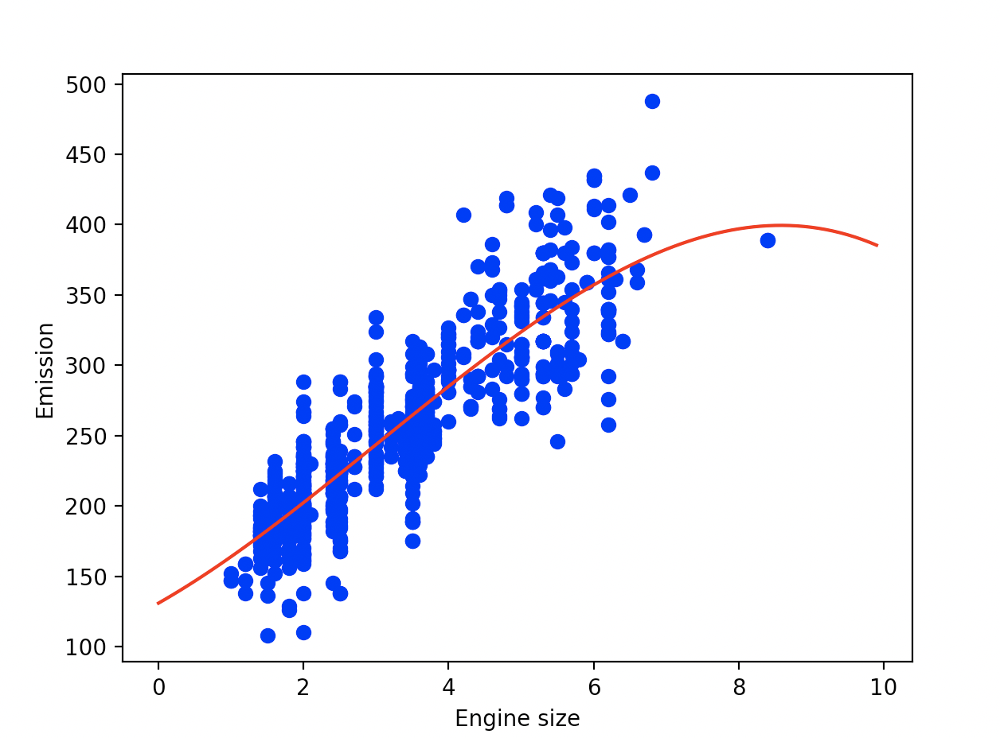

    test_x_poly3 = poly3.fit_transform(test_x)
    test_y3_ = clf3.predict(test_x_poly3)
    print("Mean absolute error: %.2f" % np.mean(np.absolute(test_y3_ - test_y)))
    print("Residual sum of squares (MSE): %.2f" % np.mean((test_y3_ - test_y) ** 2))
    print("R2-score: %.2f" % r2_score(test_y3_, test_y))

*[scikit-learn -> regresión lineal simple](#linealsimple)* 
*[scikit-learn -> regresión lineal multiple](#multiple)* 
*[scikit-learn -> regresión polinómica](#polinomica)* 
*[scikit-learn -> regresión no lineal](#noLineal)* 
## Regresion no lienal:
### Importando las librerías requeridas:
    import numpy as np
    import matplotlib.pyplot as plt
    %matplotlib inline

Las regresiones no-lineales son una relación entre variables independientes  𝑥  y una variable dependiente  𝑦  que resulta en una función no lineal. Básicamente, cada relación que no es lineal puede transformarse en una no lineal, y generalmente se representa con el polinomio de grados  𝑘  (potencia máxima de  𝑥 ).
    𝑦=𝑎𝑥3+𝑏𝑥2+𝑐𝑥+𝑑 
 
Las funciones no lineales pueden tener elementos como exponentes, logaritmos, fracciones y otros. Por ejemplo:
    𝑦=log(𝑥)
 
O más complicados, como :
    𝑦=log(𝑎𝑥3+𝑏𝑥2+𝑐𝑥+𝑑)

### gráfico de la función cúbica:
    x = np.arange(-5.0, 5.0, 0.1)

    ##Puede ajustar la pendiente y la intersección para verificar los cambios del gráfico
    y = 1*(x**3) + 1*(x**2) + 1*x + 3
    y_noise = 20 * np.random.normal(size=x.size)
    ydata = y + y_noise
    plt.plot(x, ydata,  'bo')
    plt.plot(x,y, 'r') 
    plt.ylabel('Variable dependiente')
    plt.xlabel('Variable indepdendiente')
    print(plt.show())
    
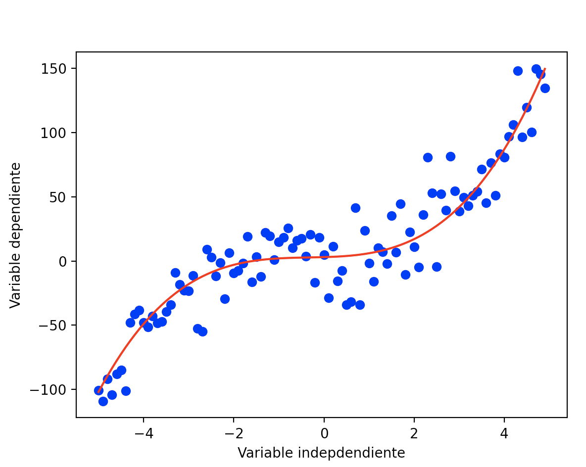
    
Como se puede ver, esta función tiene  𝑥3  y  𝑥2  como variables independientes. También, el gráfico de esta función no es una linea directa, por lo que es una función no lineal.

## Algunas otras funciones no lineales son:
### Cuadrática 𝑌=𝑋2
    x = np.arange(-5.0, 5.0, 0.1)

    ##Se puede ajustar la pendiente y la intersección para verificar los cambios en el gráfico
    y = np.power(x,2)
    y_noise = 2 * np.random.normal(size=x.size)
    ydata = y + y_noise
    plt.plot(x, ydata,  'bo')
    plt.plot(x,y, 'r') 
    plt.ylabel('Variable dependiente')
    plt.xlabel('Variable indepdiendente')
    plt.show()

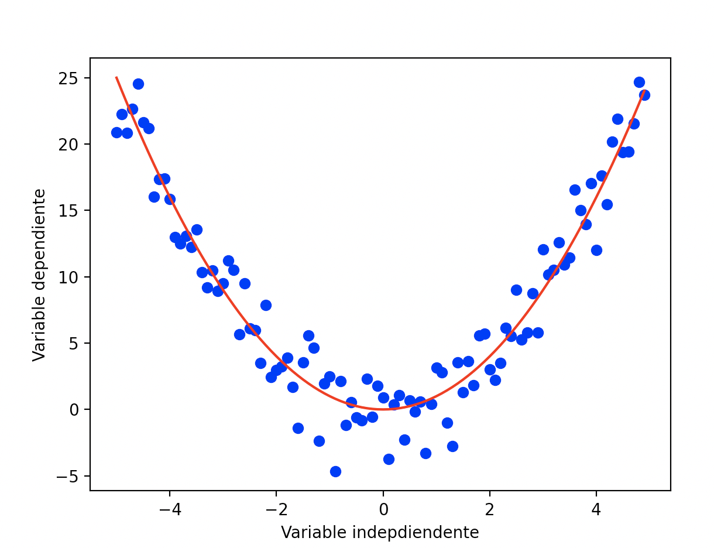

### Exponencial
Una función exponencial con base c se define por
𝑌=𝑎+𝑏𝑐𝑋

donde b ≠0, c > 0 , c ≠1, y x es cualquier número real. La base, c, es constante y el exponente, x, es una variable.
    
    X = np.arange(-5.0, 5.0, 0.1)

    ##Se puede ajustar la pendiente y la intersección para verificar los cambios en el gráfico
    Y= np.exp(X)
    plt.plot(X,Y) 
    plt.ylabel('Variable Dependiente')
    plt.xlabel('Variable Independiente')
    plt.show()
    
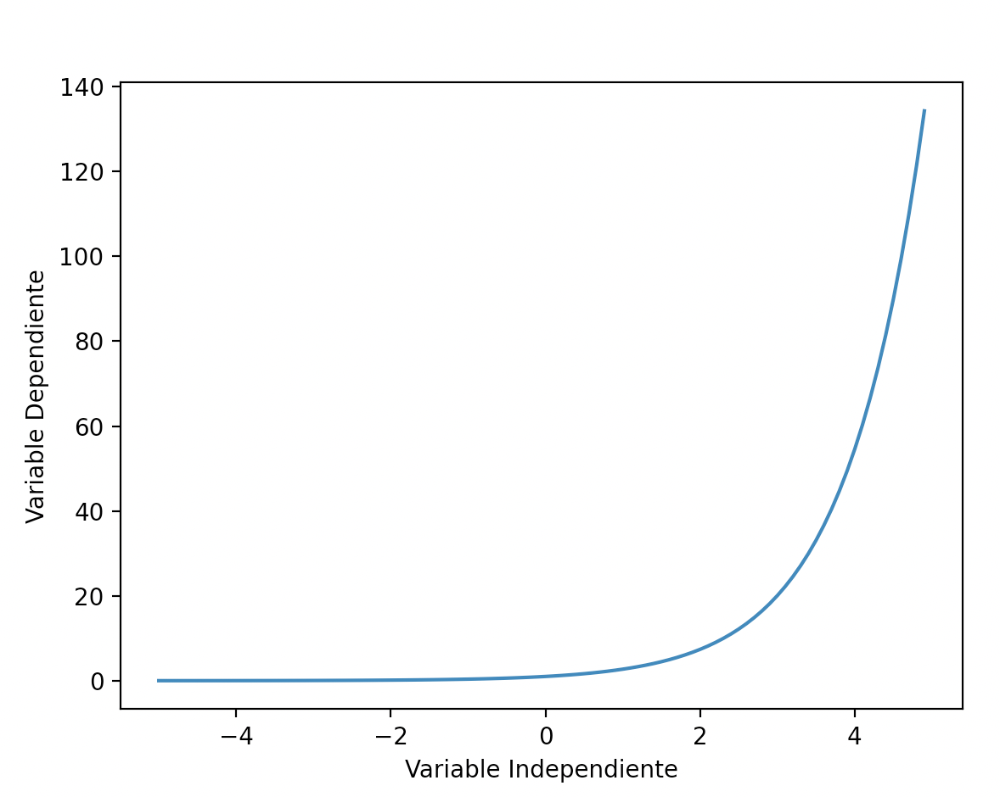
    
### Logarítmico
La respuesta  𝑦  es el resultado de aplicar el mapa logarítmico desde el valor de entrada de  𝑥  a la variable de salida  𝑦 . 
Es una de las formas más simples de 
log(): i.e. 𝑦=log(𝑥)
 
considerar que en vez de  𝑥 , podemos usar  𝑋 , el cual puede ser una representación polinomial de las  𝑥 's. En su forma general, se escribiría como 
𝑦=log(𝑋)

    X = np.arange(-5.0, 5.0, 0.1)
    
    ##Se puede ajustar la pendiente y la intersección para verificar los cambios en el gráfico
    Y = np.log(X)
    plt.plot(X,Y) 
    plt.ylabel('Variable Dependiente')
    plt.xlabel('Variable Independiente')
    plt.show()
    
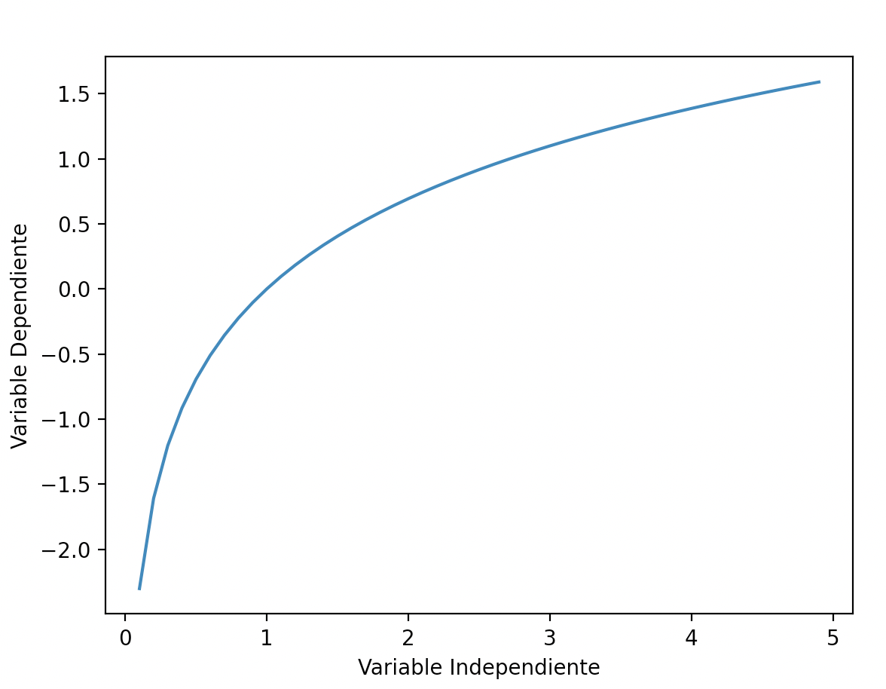
    
### Sigmoidal/Logística 𝑌=𝑎+𝑏1+𝑐(𝑋−𝑑)
    X = np.arange(-5.0, 5.0, 0.1)

    Y = 1-4/(1+np.power(3, X-2))

    plt.plot(X,Y) 
    plt.ylabel('Variable Dependiente')
    plt.xlabel('Variable Independiente')
    plt.show()
        
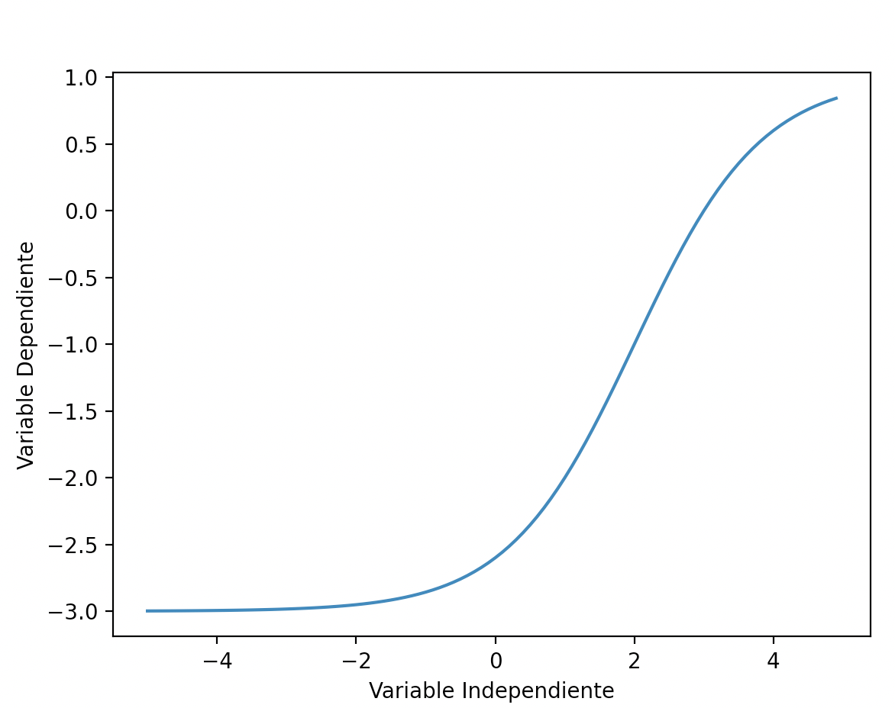
    
### Ejemplo Regresión No-Lineal:
Por ejemplo, intentaremos fijar un modelo no lineal a los puntos correspondientes al GDP de China entre los años 1960 y 2014. Descargaremos un set de datos con dos columnas, la primera, un año entre 1960 y 2014, la segunda, el ingreso anual de China en dólares estadounidenses para ese año.
    
    import numpy as np
    import pandas as pd
    import wget as wget
    import matplotlib.pyplot as plt
    from sklearn.metrics import r2_score
    from scipy.optimize import curve_fit

### downloading dataset
    url = 'https://s3-api.us-geo.objectstorage.softlayer.net/cf-courses-data/CognitiveClass/ML0101ENv3/labs/china_gdp.csv'
    wget.download(url, 'china_gdp.csv')
    
### leemos los datos obtenidos y mostramos los 10 primeros:
    df = pd.read_csv("china_gdp.csv")
    df.head(10)
    
### Marcando el set de datos:
    plt.figure(figsize=(8,5))
    x_data, y_data = (df["Year"].values, df["Value"].values)
    plt.plot(x_data, y_data, 'ro')
    plt.ylabel('GDP')
    plt.xlabel('Year')
    plt.show()
    
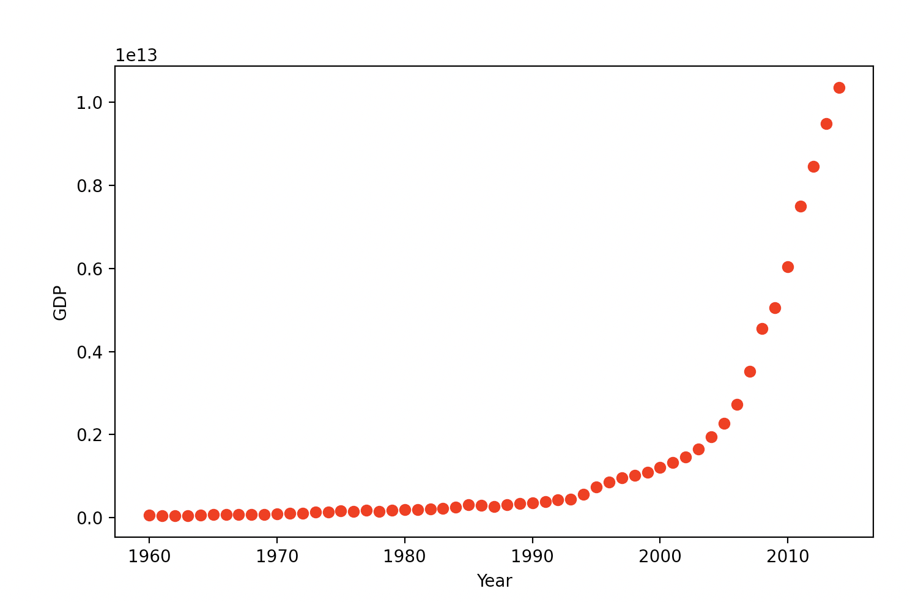
    
### Eligiendo un modelo:
    X = np.arange(-5.0, 5.0, 0.1)
    Y = 1.0 / (1.0 + np.exp(-X))

    plt.plot(X,Y) 
    plt.ylabel('Variable Dependiente')
    plt.xlabel('Variable Independiente')
    plt.show()
    
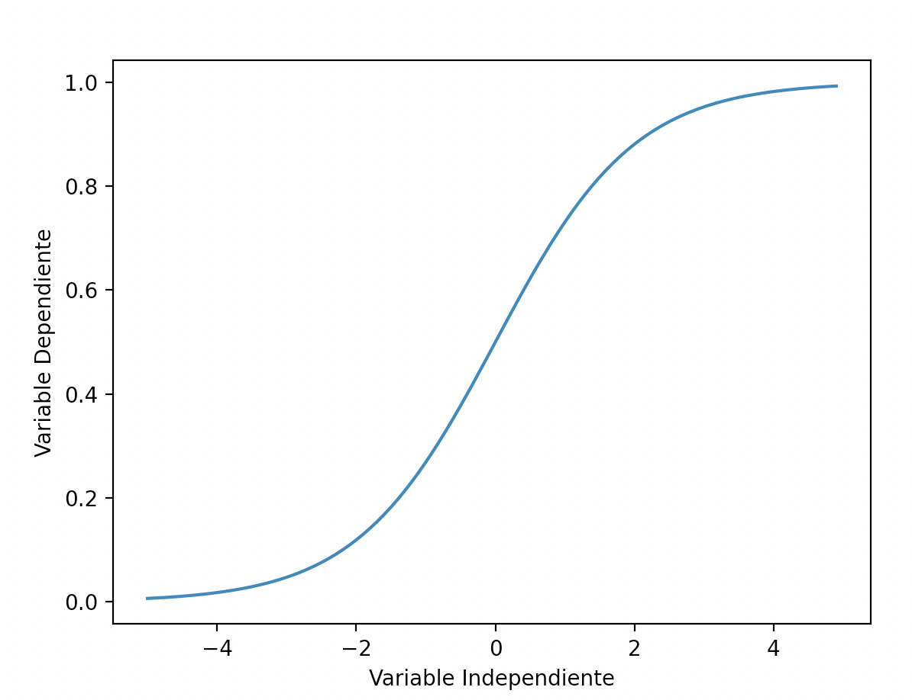
    
### Construyendo el Modelo:
    def sigmoid(x, Beta_1, Beta_2):
        y = 1 / (1 + np.exp(-Beta_1*(x-Beta_2)))
        return y

### sigmoide posible:
    beta_1 = 0.10
    beta_2 = 1990.0

    #función logística
    Y_pred = sigmoid(x_data, beta_1 , beta_2)

    #predicción de puntos
    plt.plot(x_data, Y_pred*15000000000000.)
    plt.plot(x_data, y_data, 'ro')
    
### busqueda de mejores parámetros y normalizar x e y:
    # Normalicemos nuestros datos
    xdata =x_data/max(x_data)
    ydata =y_data/max(y_data)

### ¿Cómo podemos encontrar los mejores parámetros para nuestra linea?
podemos utilizar curve_fit la cual utiliza cuadrados mínimos no lineales para cuadrar con la función sigmoide
popt son nuestros parámetros optimizados.

    from scipy.optimize import curve_fit
    popt, pcov = curve_fit(sigmoid, xdata, ydata)
    #imprimir los parámetros finales
    print(" beta_1 = %f, beta_2 = %f" % (popt[0], popt[1]))
    
### Dibujamos nuestro modelo de regresión:
    x = np.linspace(1960, 2015, 55)
    x = x/max(x)
    plt.figure(figsize=(8,5))
    y = sigmoid(x, *popt)
    plt.plot(xdata, ydata, 'ro', label='data')
    plt.plot(x,y, linewidth=3.0, label='fit')
    plt.legend(loc='best')
    plt.ylabel('GDP')
    plt.xlabel('Year')
    plt.show()
    
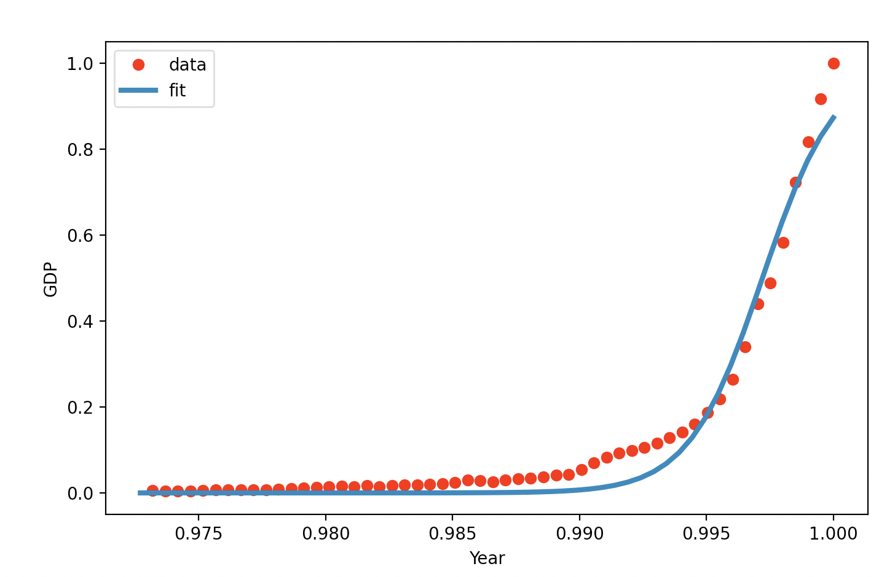
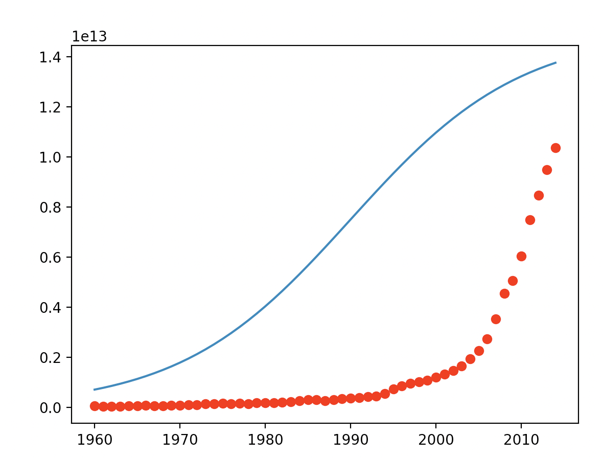

###  calcular la exactitud del modelo:
    msk = np.random.rand(len(df)) < 0.8
    train_x = xdata[msk]
    test_x = xdata[~msk]
    train_y = ydata[msk]
    test_y = ydata[~msk]

### construye el modelo utilizando el set de entrenamiento
    popt, pcov = curve_fit(sigmoid, train_x, train_y)

### predecir utilizando el set de prueba
    y_hat = sigmoid(test_x, *popt)

### evaluation:
    print("Promedio de error absoluto: %.2f" % np.mean(np.absolute(y_hat - test_y)))
    print("Suma residual de cuadrados (MSE): %.2f" % np.mean((y_hat - test_y) ** 2))
    print("R2-score: %.2f" % r2_score(y_hat , test_y) )

[Subir](#top)
