
# Visualizacion de datos
 Pandas series: <http://pandas.pydata.org/pandas-docs/stable/generated/pandas.Series.plot.html> 
 Matplotlib anotaciones: <http://matplotlib.org/api/pyplot_api.html#matplotlib.pyplot.annotate> 
#### Tipo de gráficos:
1) Gráfico de área
2) Gráfico de histogramas
3) Gráficos de barras / bar_chart
4) Gráfico circular

*[Gráfico de área](#Área)* 
*[Gráfico de histogramas](#histogramas)* 
*[Gráficos de barras/bar_char](#barras)* 
*[Gráfico circular](#circular)* 

#### Gráfico de área:
Los gráficos de área se utilizan para mostrar el desarrollo de valores cuantitativos a lo largo de un intervalo o período de tiempo.
 **Ejemplo:** 
vamos a mostrar tanto los cinco paises que más contribuyen con la imigración como los que menos contibuyen 
Conjunto de Datos: Inmigración en Canadá desde 1980 a 2013 – Flujos migratorios internacionales a y desde los países seleccionados – (Revisión de 2015 del portal de la ONU).

##### TAREAS GENERICAS
##### INSTALAMOS MÓDULO XLRD:
modulo requerido por pandas para poder leer archivos de Excel
    
    pip3 install xlrd
    
##### 1) Importamos las librerías necesarias:
    import matplotlib as mpl
    import matplotlib.pyplot as plt
    import numpy as np  # muy útil para cálculos científicos con Python
    import pandas as pd # Librería para estructar datos primarios
    
##### 2) Obtenemos el dataset deprueba (como se puede observar es de tipo excel):
    df_can = pd.read_excel('https://s3-api.us-geo.objectstorage.softlayer.net/cf-courses-data/CognitiveClass/DV0101EN/labs/Data_Files/Canada.xlsx',
                       sheet_name='Canada by Citizenship',
                       skiprows=range(20),
                       skipfooter=2
                      )

    print('Data downloaded and read into a dataframe!')

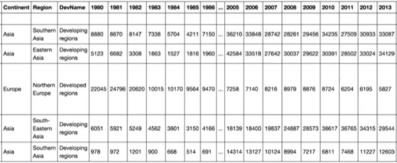

##### 3) Imprimir el tamaño del DataFrame
    print(df_can.shape)

##### 4) Limpiar el conjunto de datos para borrar las columnas que no ofrecen información en nuestra visualización
    df_can.drop(['AREA', 'REG', 'DEV', 'Type', 'Coverage'], axis=1, inplace=True)
    
##### 5) Veamos los primeros cinco elementos para ver como cambió el DataFrame
    print(df_can.head())
    
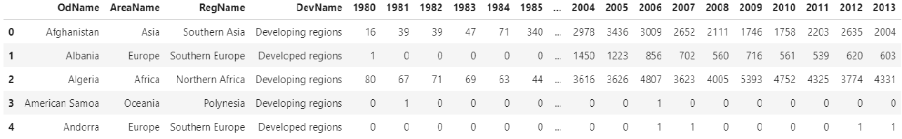 

##### 6) cambiar los nombres de las columnas
    df_can.rename(columns={'OdName':'Country', 'AreaName':'Continent','RegName':'Region'}, inplace=True)
    print(df_can.head())

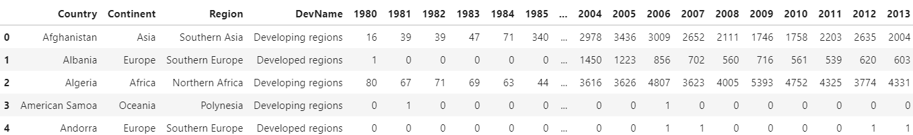 

##### 7) Revisar el tipo de dato de las etiquetas de las columnas todas deben ser de tipo cadena
* mostrará true si son de tipo cadena y false si no
      
      all(isinstance(column, str) for column in df_can.columns)
    
* convertimos a tipo cadena

      df_can.columns = list(map(str, df_can.columns))

* Revisemos el ahora el tipo de dato en los nombres de las columnas

      all(isinstance(column, str) for column in df_can.columns)

* Cambiamos los indices por country y añadimos la columna total:
  
      df_can.set_index('Country', inplace=True)
      df_can['Total'] = df_can.sum(axis=1)
      print(df_can.head())
    
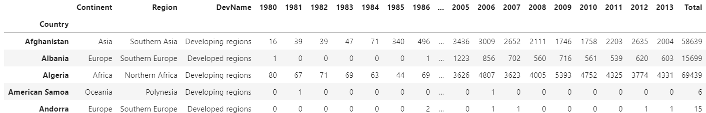 

* En caso de querer definir los años a usar - de utilidad para graficas más adelante (opcional en este punto)
 
      years = list(map(str, range(1980, 2014)))
      print('data dimensions:', df_can.shape)

### DIAGRAMA DE ÁREA:
#### paises que más contribuyen
##### Obtenemos la lista de años dese 1980 a 2014
     years = list(map(str,range(1980,2014)))
     
##### Ordenadmos los datos de la columna total, sort_values()
    df_can.sort_values(['Total'], ascending=False, axis=0, inplace=True)
   
##### Obtenemos los cinco primeros valores, head()
    df_top5 = df_can.head()
  
##### transponer el DataFrame (vertical to horizontal)
    df_top5 = df_top5[years].transpose() 
    print(df_top5.head())
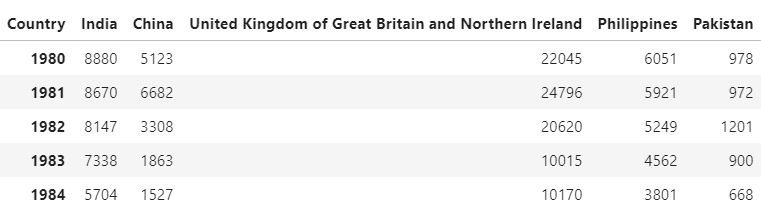 
       
##### cambiar el valor de los índices de df_top5 a tipo entero para graficarlos
    df_top5.index = df_top5.index.map(int)
    
##### generamos el tipo de gráfico capa de Scripting (método procedural)
    df_top5.plot(kind='area', 
             alpha=0.25,   #0-1, valor por defecto a 0.5
             stacked=False,   #Para crear una grafica no apilada estableceremos stacked=False.
             figsize=(20, 10), # pasar el tamaño de tupla (x, y)
             )
             
##### Pintamos el gráfico y lo mostramos capa de Scripting (método procedural)
    plt.title('Immigration Trend of Top 5 Countries')
    plt.ylabel('Number of Immigrants')
    plt.xlabel('Years')

    plt.show()
    
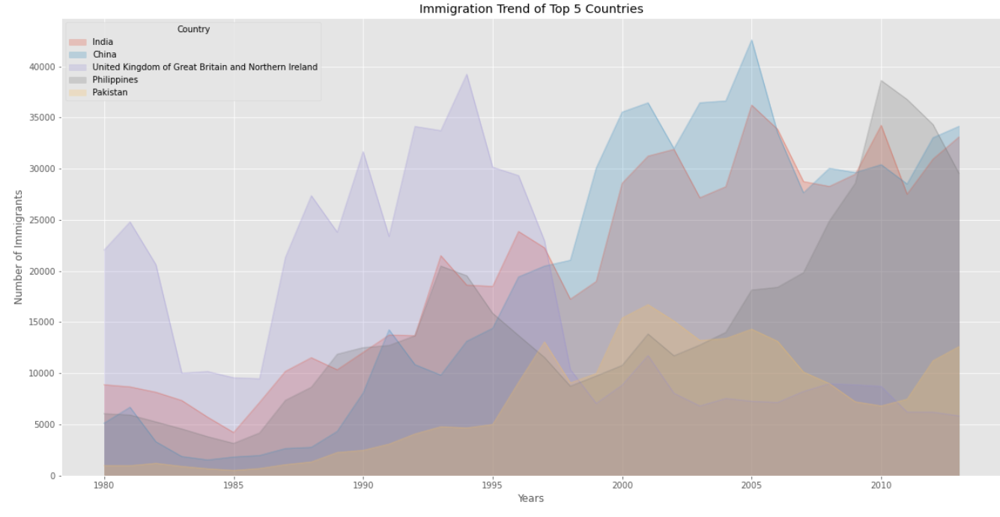

##### Pintamos el gráfico y lo mostramos Capa de Artista  (método orientado a objetos)
* generamos el tipo de gráfico  capa de Scripting (método procedural)
    
      ax = df_top5.plot(kind='area', alpha=0.35, figsize=(20, 10))

* Pintamos el gráfico capa de Scripting (método procedural)

      ax.set_title('Immigration Trend of Top 5 Countries')
      ax.set_ylabel('Number of Immigrants')
      ax.set_xlabel('Years')
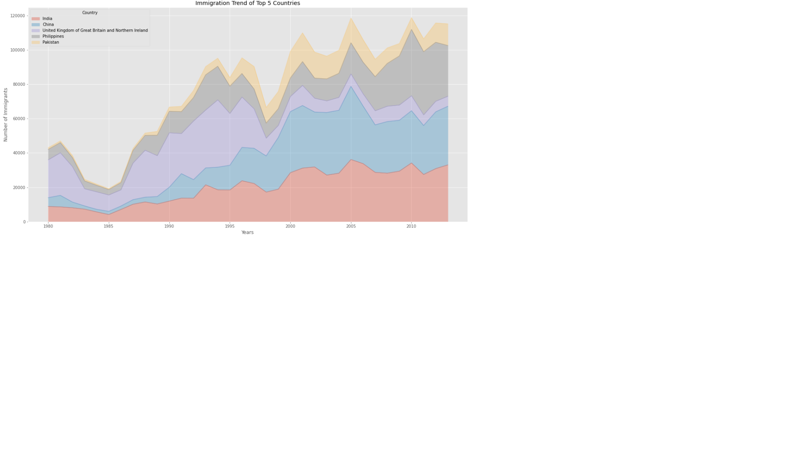
### Mostrar los cinco paises que menos contribuyen con la imigración
##### Obtenemos los cinco primeros valores, head()
    df_least5 = df_can.tail(5)
    
##### Transpose the dataframe
    df_least5 = df_least5[years].transpose() 
    print(df_least5.head())
    
##### Cambiar el valor de los índices de df_top5 a tipo entero para graficarlos
    df_least5.index = df_least5.index.map(int)
    df_least5 = df_least5.plot(kind='area', alpha=0.55, stacked=False, figsize=(20, 10))

##### Pintamos la gráfica
    plt.title('Immigration Trend of 5 Countries with Least Contribution to Immigration')
    plt.ylabel('Number of Immigrants')
    plt.xlabel('Years')

    plt.show()

#### HISTOGRAMAS:
Un histograma representa la distribución de frecuencia de un conjunto de datos numéricos. La forma en que trabaja es dividiendo el eje x en contenedores y asignando cada dato dentro del conjunto a uno de ellos para después contar el numero de datos asignado a cada contenedor. De esta forma el eje y es la frecuencia o el numero de datos en cada contenedor.
 **Ejemplo:** 
¿Cuál es la distribución de frecuencias de la cantidad de inmigrantes provenientes de distintos países hacia Canadá en 2013?
**Nota:** Primero devemos dividir los datos en intervalos. Para esto, usaremos el método histrogram de Numpy para obtener el rango de los contenedores y el conteo de frecuencias.
    
##### revisar rapidamente los datos de 2013 
    df_can['2013'].head()

##### np.histogram regresa 2 valores
    count, bin_edges = np.histogram(df_can['2013'])

    print(count) # conteo de las frecuencias
    print(bin_edges) # rango de los contenedores, por defecto son 10 contenedores
    
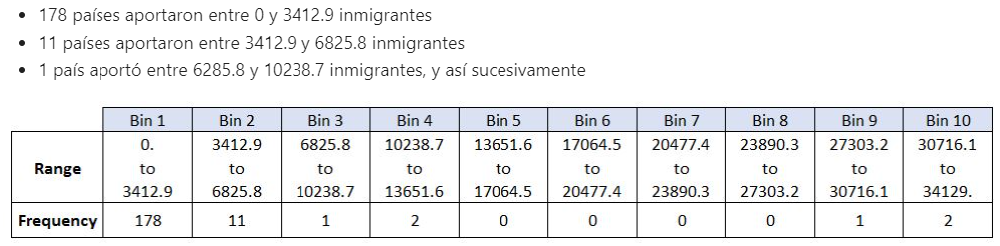

**Nota:** Por defecto, el método histrogram divide el conjunto de datos en 10 contenedores.

##### Pintamos la gráfica (las columnas salen descentradas)
    df_can['2013'].plot(kind='hist', figsize=(8, 5))

    plt.title('Imigración 195 paises en 2013') # añade un titulo al histograma
    plt.ylabel('Número de paises') # añadir etiqueta de y
    plt.xlabel('Número de imigrantes') # añadir etiqueta de x

    plt.show()
    
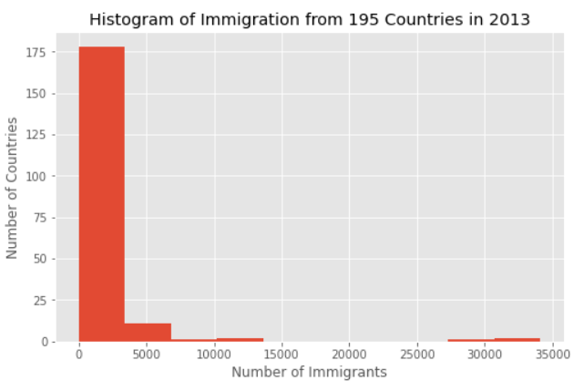

**Nota:** Obsérvese que las etiquetas del eje x no corresponden con el tamaño del contenedor. Esto se soluciona pasando una palabra xticks que contenga la lista de los tamaños de los contenedores como se explica a continuación:

##### Pintamos la gráfica con las columnas centradas (xticks=bin_edges)
* 'bin_edges' es una lista de los intervalos de los contenedores 

      count, bin_edges = np.histogram(df_can['2013'])
      df_can['2013'].plot(kind='hist', figsize=(8, 5), xticks=bin_edges)

      plt.title('Imigración 195 paises en 2013') # añade un titulo al histograma
      plt.ylabel('Número de paises') # añadir etiqueta de y
      plt.xlabel('Número de imigrantes') # añadir etiqueta de x

      plt.show()

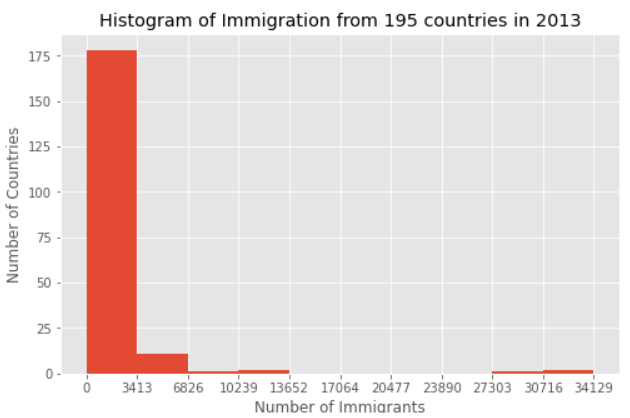

¿Cual es la distribución de la inmigración en Dinamarca, Noruega y Suecia desde 1980 a 2013?

    df_can.loc[['Denmark', 'Norway', 'Sweden'], years]
    
 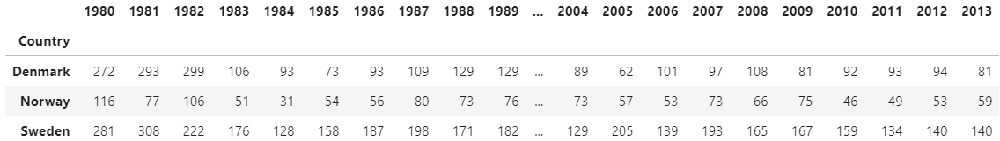
 
##### Generamos el histograma:
* Obtener los datos y trasponerlos
    
      df_t = df_can.loc[['Denmark', 'Norway', 'Sweden'], years].transpose()
      print(df_t.head())
    
* Generar el histograma
    
      df_t.plot(kind='hist', figsize=(10, 6))

      plt.title('Histogram of Immigration from Denmark, Norway, and Sweden from 1980 - 2013')
      plt.ylabel('Number of Years')
      plt.xlabel('Number of Immigrants')

      plt.show()
    
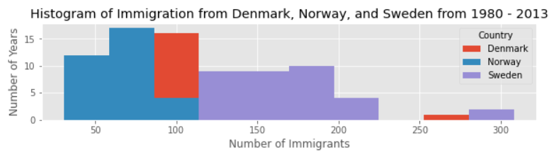

**Nota:** El resultado no es muy fino dado que sale apilado, por lo que vamos a realizar las siguientes modificaciones para que se vea bien:
1. Incrementar el tamaño de contenedor a 15 pasando el parámetro bins
2. establecer una transparencia del 60% con el parámetro alpha
3. etiquetar el eje x con el parámetro x-label
4. cambiar el color de las graficas con el parámetro color

* Obtener los valores de x
 
      count, bin_edges = np.histogram(df_t, 15)
      
* Generar el histograma
  
      df_t.plot(kind ='hist', 
          figsize=(10, 6),
          bins=15,
          alpha=0.6,
          xticks=bin_edges,
          color=['coral', 'darkslateblue', 'mediumseagreen']
         )

      plt.title('Histogram of Immigration from Denmark, Norway, and Sweden from 1980 - 2013')
      plt.ylabel('Number of Years')
      plt.xlabel('Number of Immigrants')

      plt.show()

#### DIAGRAMA DE BARRAS:
La grafica de barras es una manera de representación de datos donde la longitud de las barras muestran la magnitud/tamaño de una característica/variable. Estas graficas usualmente representan de forma numérica y por categoría, variables agrupadas en intervalos.

Para crear una grafica de barras tenemos que pasar uno o dos argumentos mediante el parámetro kind en la función plot():

* kind=bar crea una grafica de barras verticales
* kind=barh crea una grafica de barras horizontales

**Grafica de Barras Verticales**

En las graficas de barras verticales, el eje x se usa para el etiquetado y la longitud de las barras en el eje y corresponde a la magnitud de la variable utilizada. Estas graficas son particularmente útiles en el análisis para series de datos de tiempo. Una desventaja es que carecen de espacio para añadir una etiqueta al pie de cada barra.

**Efecto de la Crisis Financiera de Islandia:**
De 2008 a 2011 la crisis financiera de Islandia fue el mayor evento económico y político de ese país. En relación con el tamaño de su economía, el colapso de sistema bancario de Islandia fue el mas grande experimentado por cualquier en la historia de la economía. La crisis llevó a una severa depresión económica de 2008 a 2011 y una significante agitación política.

Comparación del número de inmigrantes Islandeses a Canadá durante el periodo de 1980 a 2013.
##### paso 1: obtener los datos
    df_iceland = df_can.loc['Iceland', years]
    df_iceland.head()

##### paso 2: graficar los datos
    df_iceland.plot(kind='bar', figsize=(10, 6), rot=90)

    plt.xlabel('Year') # añadir etiquetado al eje x de la grafica
    plt.ylabel('Number of immigrants') # añadir etiquetado al eje y de la grafica
    plt.title('Icelandic immigrants to Canada from 1980 to 2013') # añadir un titulo a la grafica

    plt.show()
    
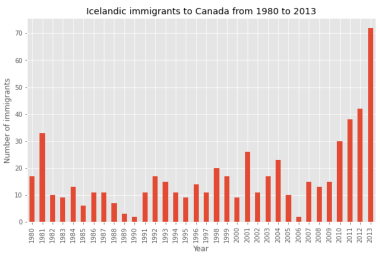

**Nota:** La grafica de barras de arriba muestra el numero total de inmigrantes divididos por año. Podemos ver claramente el impacto de la crisis financiera; el numero de inmigrantes hacia Canadá comenzó a incrementarse rápidamente después de 2008.

Anotemos esto en la grafica usando el método annotate de la capa de scripting o la interfaz pyploy. Pasaremos los siguientes parámetros:

* **s:** str, el texto de la anotación.
* **xy:** Tupla para especificar el punto (x,y) a ser anotado (en este caso, el punto final de la flecha).
* **xytext:** Tupla para especificar el punto (x,y) donde colocar el texto (en este caso, el punto inicial de la flecha)
* **xycoords:** El sistema de coordenadas xy dado - 'data' utiliza el sistema de coordenadas del objeto a ser anotado (por defecto).
* **arrowprops:** Toma un diccionario de propiedades para dibujar la flecha:
    - **arrowstyle:** Especifica el estilo de la flecha, '->' es la flecha estandar.
    - **connectionstyle:** Especifica el tipo de conexión. arc3 es una línea recta.
    - **color:** Especifica el color de la flecha.
    - **lw:** Especifica el ancho de la flecha.
    

##### flecha de la anotación, plt.annotate()
    plt.annotate('',                      # s: str. Se dejará en blanco si no hay texto
             xy=(32, 70),             # ubicará la cabeza de la flecha en el punto (año 2012, pob 70)
             xytext=(28, 20),         # ubicará la base de la flecha en el punto (año 2008, pob 20)
             xycoords='data',         # Usará el sistema de coordenadas del objeto a ser anotado 
             arrowprops=dict(arrowstyle='->', connectionstyle='arc3', color='blue', lw=2)
            )

    plt.show()

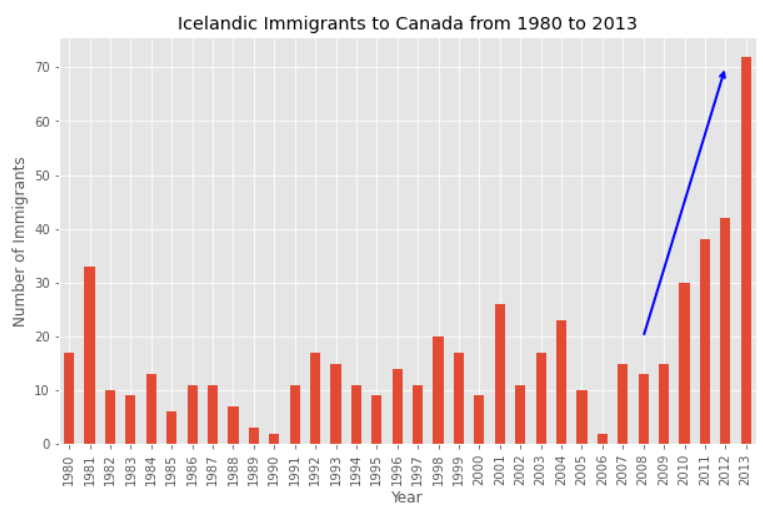

Anotemos el texto que ira sobre la flecha. Pasaremos los siguientes parámetros adicionales:

* **rotation:** Angulo de rotación del texto dado en grados (al revés de las manecillas del reloj)
* **va:** alineación vertical del texto [‘centro’ | ‘arriba’ | ‘abajo’ | ‘fondo’]
* **ha:** alineación horizontal del texto [‘centro’ | ‘derecha’ | ‘izquierda’]

##### Texto de la anotación
    plt.annotate('2008 - 2011 Financial Crisis', # texto a mostrarse 
             xy=(28, 30),                    # empieza el texto en el punto (año 2008, pob 30)
             rotation=72.5,                  # basado en prueba y error para igualar la flecha
             va='bottom',                    # el texto se alineara verticalmente 'abajo'
             ha='left',                      # el texto se alineara horizontalmente a la 'izquierda'
            )

    plt.show()

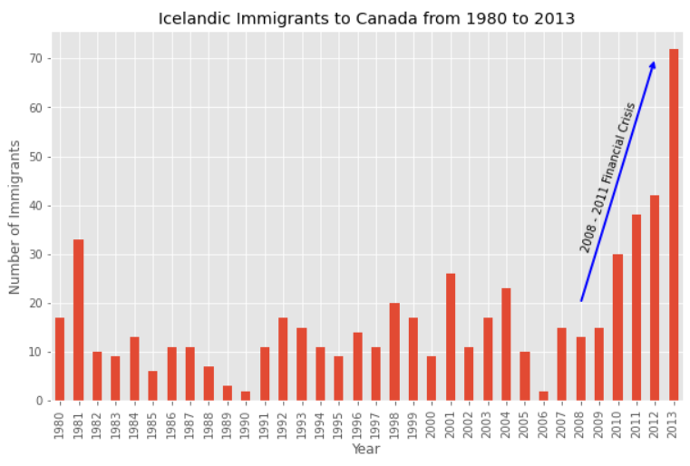

**pregunta:** Al utilizar la capa de scripting y el conjunto de datos df_can, se crea una grafica de barras horizontales que muestra el numero total de inmigrantes en Canadá proveniente de los 15 países que mas aportan para el periodo de 1980 a 2013. Etiqueta cada país con el numero total de inmigrantes.

##### paso 1: Ordenamos y obtenemos los datos
    df_can.sort_values(by='Total', ascending=True, inplace=True)
    df_top15 = df_can['Total'].tail(15)
    df_top15
    
##### Paso2: graficamos los datos:
* Generamos plot

      df_top15.plot(kind='barh', figsize=(12,12), color='steelblue')
      plt.xlabel('Número de inmigrantes')
      plt.title('top 15 pais que mas contribuyeron en la imigracion de Canada entre 1980 - 2013)
      
 * anotamos los valores de las etiquetas a cada pais
      
       for index, value in enumerate(df_top15):
         print('index: ',index)
         print('value: ',value)
         label = format(value,',')
      
 * anotamos el texto al final de la barra
 
         plt.anotate(label, xy=(value - 47000, index - 0.10), color='white')
       plt.show()

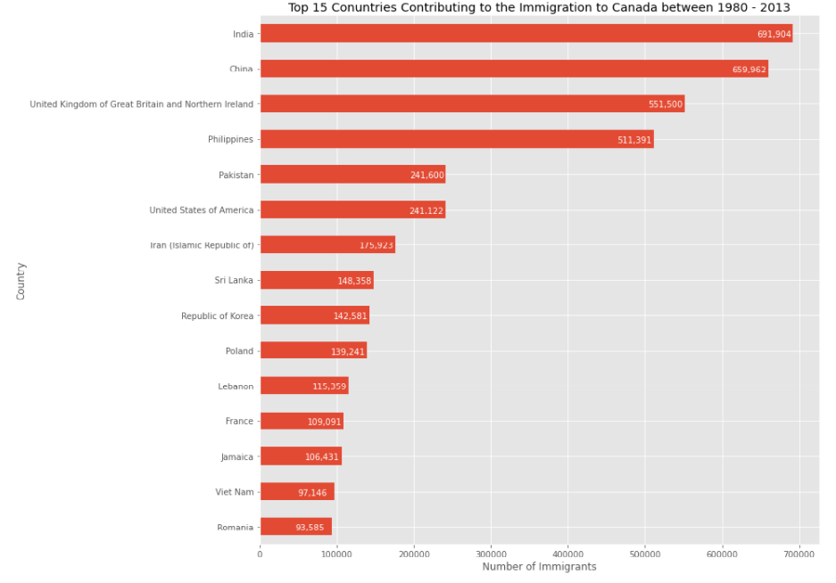

#### GRÁFICO CIRCULAR o DE TARTA:
Un gráfico circular o gráfica circular, también llamado "gráfico de pastel ", "gráfico de tarta",gráfico de "Queque" , "gráfico de torta" o "gráfica de 360 grados", es un recurso estadístico que se utiliza para representar porcentajes y proporciones, o se puede decir que es un gráfico estadístico dividido en rodajas para ilustrar la proporción numérica.  El número de elementos comparados dentro de una gráfica circular suele ser de más de cuatro.

Un Diagramas de Pastel es un gráfico circular que muestra proporciones numéricas al dividir un circulo (o pastel) en pedazos proporcionales. Seguramente te resulten familiares estos diagramas ya que son extensamente usados en los negocios y medios de comunicación. Podemos crear diagramas de pastel en Matplotlib usando la palabra clave kind=pie.

Usemos uno de estos diagramas para explorar la proporción (porcentaje) de nuevos inmigrantes agrupados por continentes para el periodo de 1980 a 2013.

**Paso 1: Recolección de Datos.**
Usaremos el método de pandas groupby para resumir los datos de inmigración por Continente. El proceso general de groupby consta de los siguientes pasos:

* **Split:** Dividir los datos en grupos en base a algún criterio.
* **Apply:** Aplicar independientemente una función a cada grupo: .sum() .count() .mean() .std() .aggregate() .apply() .etc..
* **Combine:** Juntar los resultados en una estructura de datos

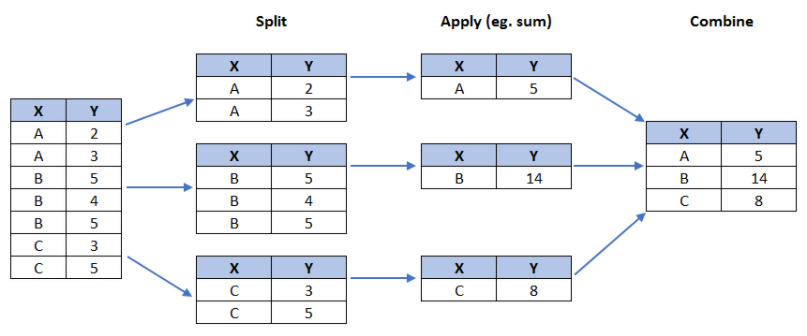

* agrupar los países por continente y aplicar la función sum()
   
      df_continents = df_can.groupby('Continent', axis=0).sum()

* observación: la salida del método groupby es un objeto `groupby'
no podemos usarla hasta que se aplique una función (p. ej. .sum())
  
      print('Es de tipo:', type(df_can.groupby('Continent', axis=0)))
      print(df_continents.head())
      
* OutPut:
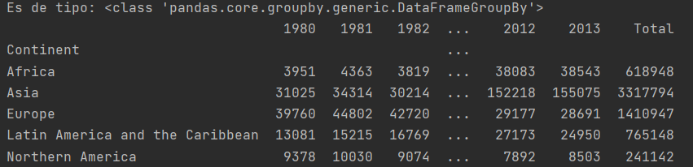 

**Paso 2: Gráficar los datos.** 
Usaremos **kind = 'pie'** junto con el resto de los parametros:

* **autopct** - es una cadena o función usada para etiquetar las partes de la gráfica con su valor numérico. La etiqueta sera puesta dentro de cada porcion. Si es una cadena con formato, la etiqueta será fmt%pct.
* **startangle** - rota el inicio del pastel en grados en sentido horario opuesto desde el eje x.
* **shadow** - Dibuja una sombra bajo el pastel (para darle un aspecto 3D).

**autopct crea %, el angulo de inicio representa el punto de inicio**
           
           df_continents['Total'].plot(kind='pie', figsize=(5, 6), # el pastel tiene aspecto circular
                            autopct='%1.1f%%', # añade en porcentajes
                            startangle=90,     # angulo de inicio 90° (Africa)
                            shadow=True,       # añade sombreado
                            )
           plt.title('Immigration to Canada by Continent [1980 - 2013]')
           plt.axis('equal')
           plt.show()
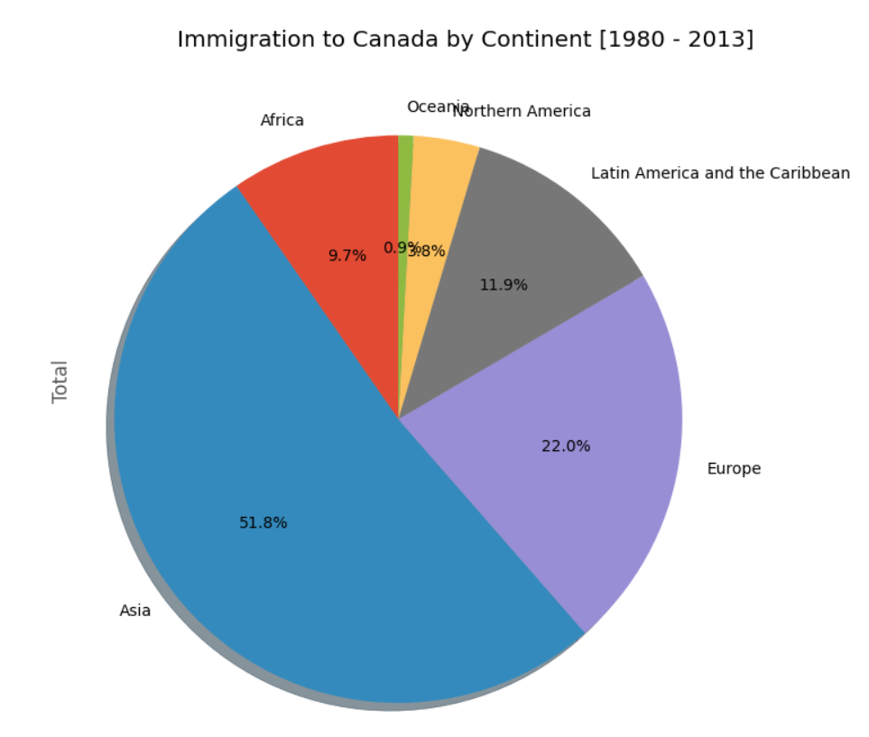

**NOTA:** La visualización de arriba no esta muy clara, los números y el texto se sobreponen en algunas partes. 

**Hagamos algunas modificaciones para mejorarla.**
* **Quitar las etiquetas de texto** en la gráfica pasandole legend y añadiendolo separadamente utilizando plt.legend().
* **Retira los porcentajes** para ponerlos afuera de la gráfica pasando el parametro pctdistance.
* **Pasa un conjunto personal de colores** a los continentes con el parametro colors.
* **Explota la gráfica** para enfatizar a los ultimos tres continente (Africa, Norte America, Latino America y el Caribe) pasando el parametro explode.

**Ajuste para mejor visualizacion**
      
      colors_list = ['gold', 'yellowgreen', 'lightcoral', 'lightskyblue', 'lightgreen', 'pink']
**la relacion para cada continente para compensar cada parte del pastel.**
      
      explode_list = [0.1, 0, 0, 0, 0.1, 0.1]
      df_continents['Total'].plot(kind='pie',
                            figsize=(15, 6),
                            autopct='%1.1f%%',
                            startangle=90,
                            shadow=True,
                            labels=None,         # deshabilita las etiquetas de la gráfica
                            pctdistance=1.12,    # la relación entre el centro de cada trozo del pastel y el inicio del texto generado por autopct
                            colors=colors_list,  # añadir colores personalizados
                            explode=explode_list # 'explota' los últimos tres continentes
                            )

**escala el título un 12% para igualar pctdistan**
     
     plt.title('Immigration to Canada by Continent [1980 - 2013]', y=1.12)
     plt.axis('equal')
**añade etiqueta**
     
     plt.legend(labels=df_continents.index, loc='upper left')
     plt.show()

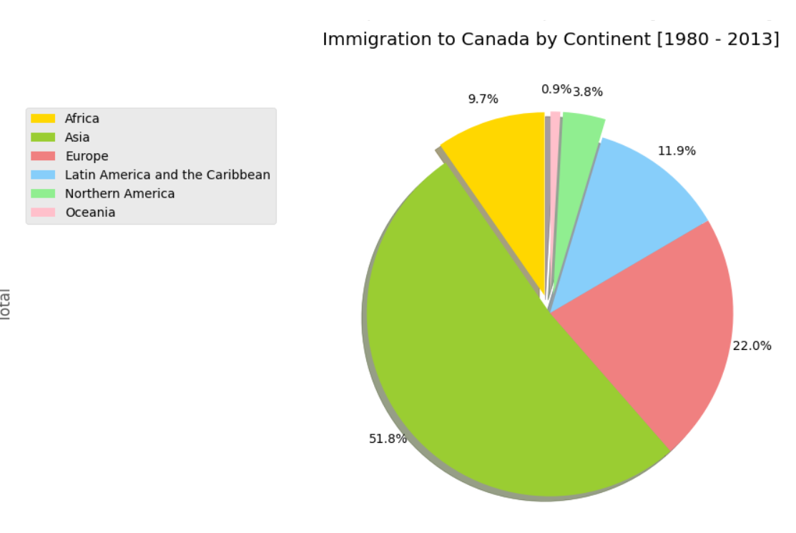

#### GRÁFICO CAJA:
También conocido como diagrama de caja y bigote, box plot, box-plot o boxplot. Es un método estandarizado para representar gráficamente una serie de datos numéricos a través de sus cuartiles. De esta manera, el diagrama de caja muestra a simple vista la mediana y los cuartiles de los datos,1​ pudiendo también representar los valores atípicos de estos. Conviene recordar que se utilizan las bisagras de Tukey, y no los cuartiles a la hora de dibujar la caja del gráfico, aunque los resultados son semejantes en muestras grandes.

Una gráfica de caja es una forma de representar estadisticamente la distribución de los datos mediante cinco dimensiones principales:
* Minimo: El número mas pequeño del conjunto de datos
* Primer Cuartil: El número del medio entre el minimo y la mediana
* Segundo Cuartil (Mediana): El número en la mitad del conjunto de datos
* Tercer Cuartil: El número del medio entre la mediana y el máximo
* Máximo: El número mas grande del conjunto

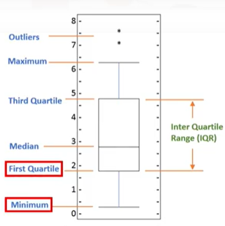

Para construir una gráfica de caja podemos utilizar kind=box en el método plot invocado en una serie de dataframe pandas.
Dibujemos la gráfica para los inmigrantes japoneses entre 1980 y 2013.

**Paso 1:** Obtener el conjunto de datos. A pesar de extraer datos para un solo país, lo haremos como un dataframe. Esto nos ayudará a llamar el método dataframe.describe() para ver los percentiles.

    df_japan = df_can.loc[['Japan'], years].transpose()
    print(df_japan.head())
    
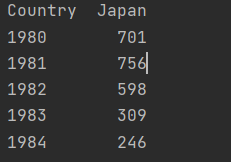
    
**Paso 2:** Paso 2: Dibujar la gráfica con kind='box'.

    df_japan.plot(kind='box', figsize=(8, 6))

    plt.title('Box plot of Japanese Immigrants from 1980 - 2013')
    plt.ylabel('Number of Immigrants')

    plt.show()

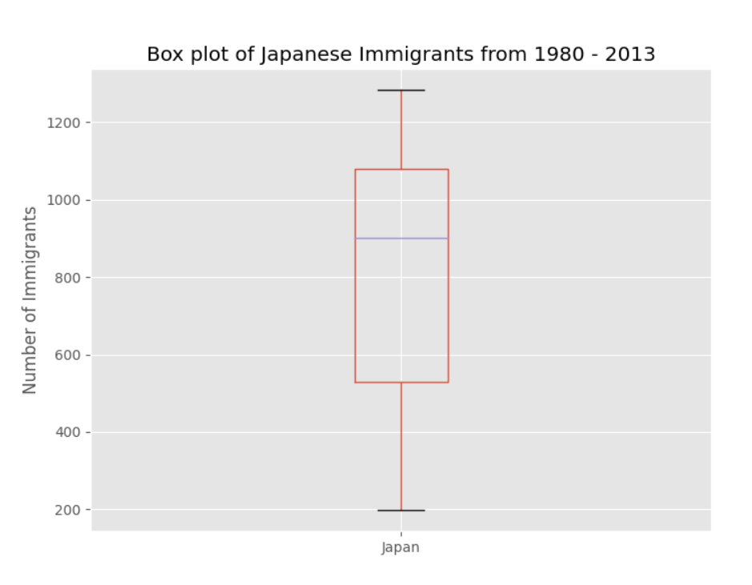

Inmediatamente podemos hacer un par de observaciones de la gráfica anterior:

* El número mínimo de inmigrantes es de alrededor de 200 (min), el máximo de 1300 (max) y una mediana de 900 (median).
* 25% de los años para el periodo 1980 - 2013 tienen una cuenta anual de inmigrantes de ~500 o menos (primer cuartil).
* 75% de los años para el periodo 1980 - 2013 tienen una cuenta anual de inmigrantes de ~1100 o menos (tercer cuartil).

**Paso 3:** Podemos ver el número actual haciendo una llamada al método describe() en el dataframe.

    df_japan.describe()
    
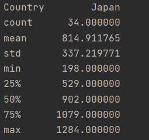    
 
 **NOTA:** Uno de los mejores beneficios de las gráficas de caja es poder comparar la distribución de dos conjuntos de datos
observamos que China e India comparten tendencias semejantes en inmigración.
Comparemos la distribución del numero de nuevos inmigrantes de India y China para el periodo 1980 - 2013.

 **Paso 1:** Obtener el conjunto de datos para China e India y llamar al dataframe df_CI.

     df_CI = df_can.loc[['China','India'], years].transpose()
     df_CI.head()
     
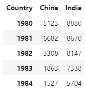
 
 **Paso 2:** Veamos los porcentajes asociados en ambos países usando el método describe().
 
    df_CI.describe()
    
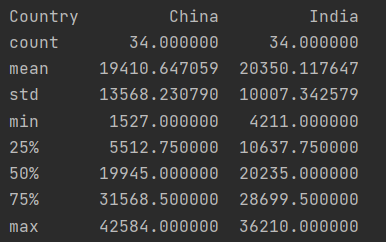
 
 **Paso 3:** Graficar vertical
     
     df_CI.plot(kind='box', figsize=(8, 6))

     plt.title('Box plot of Japanese Immigrants from 1980 - 2013')
     plt.ylabel('Number of Immigrants')

     plt.show()
 
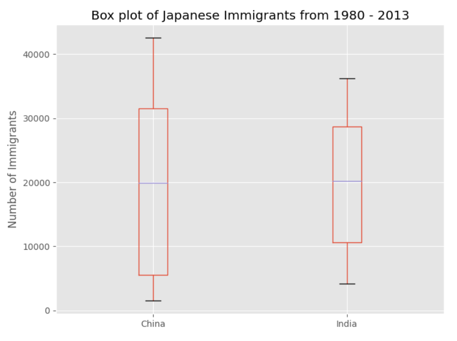
  
**Paso 3:** Graficamos horizontal
    
    df_CI.plot(kind='box', figsize=(10, 7), color='blue', vert=False)

    plt.title('Box plots of Immigrants from China and India (1980 - 2013)')
    plt.xlabel('Number of Immigrants')

    plt.show()
    
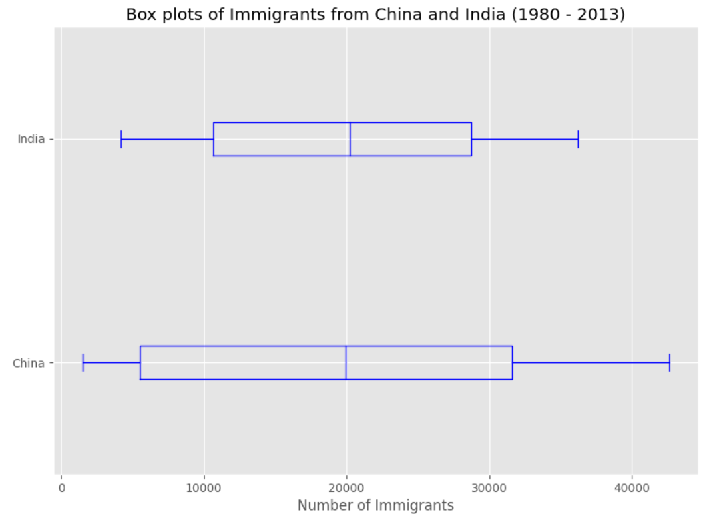

Podemos observar que mientras ambos países tiene una mediana parecida en la población inmigrante (~20,000), la de China tiene un rango mas amplio que India. La población máxima para India para cualquier año (36,210) es alrededor de 15% menos que el máxima poblacion de China (42,584).

**Paso 4:** Graficamos mixto
**Crear imagen

    fig = plt.figure()

    ax0 = fig.add_subplot(1, 2, 1) # añadir sub gráfica 1 (1 fila, 2 columnas, primer gráfica)
    ax1 = fig.add_subplot(1, 2, 2) # añadir sub gráfica 2 (1 fila, 2 columnas, segunda gráfica). Mirar tip mas abajo**

**Sub gráfica 1: Gráfica de Caja

    df_CI.plot(kind='box', color='blue', vert=False, figsize=(20, 6), ax=ax0) # añadir sub gráfica 1
    ax0.set_title('Box Plots of Immigrants from China and India')
    ax0.set_xlabel('Number of Immigrants')
    ax0.set_ylabel('Countries')

**Sub gráfica 2: Gráfica de Línea

    df_CI.plot(kind='line', figsize=(20, 6), ax=ax1) # añadir sub gráfica 2
    ax1.set_title ('Line Plots (1980 - 2013)')
    ax1.set_ylabel('Number of Immigrants')
    ax1.set_xlabel('Years')

    plt.show()

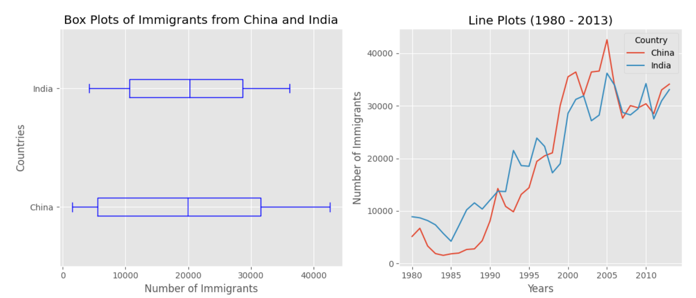

***Ejemplo**
Crea una gráfica de caja para visualizar la distribución de los 15 países principales (en base al total de inmigración) agrupados por las décadas 1980, 1990 y 2000

**Paso 1:** Obtener el conjunto de datos. Obtener los 15 primeros países en base al total de la poblacion inmigrante. Nombra al dataframe df_top15.
  
    df_top15 = df_can.sort_values(['Total'], ascending=False, axis=0).head(15)
    print(df_top15)

**Paso 2:** Crea un nuevo dataframe el cual contenga el agregado de cada década. Una forma de hacerlo es:

1. Crear una lista de todos los años separados por las decadas 80, 90 y 2000.

       years_80s = list(map(str, range(1980, 1990)))
       years_90s = list(map(str, range(1990, 2000)))
       years_00s = list(map(str, range(2000, 2010)))
       
2. Divide el dataframe original df_can para crear una serie para cada década y hacer la suma de todos los años para cada país.

       df_80s = df_top15.loc[:, years_80s].sum(axis=1)
       df_90s = df_top15.loc[:, years_90s].sum(axis=1)
       df_00s = df_top15.loc[:, years_00s].sum(axis=1)
       
3. Juntar las tres series en un nuevo dataframe. Llama a este dataframe new_df.

       new_df = pd.DataFrame({'1980s': df_80s, '1990s': df_90s, '2000s': df_00s})
       print(new_df.head())
       print(new_df.describe())
       
       

4. Graficamos

       new_df.plot(kind='box', figsize=(10, 7), color='blue', vert=False)

       plt.title('Box plots of Immigrants from China and India (1980 - 2013)')
       plt.xlabel('Number of Immigrants')

       plt.show()

**NOTA:** #Observa como la gráfica de caja es distinta de la tabla resumida que se creó. La gráfica escanea los datos e identifica los que estan separados (outliers). 
Para reconocer un dato separado, su valor debe ser:

* mayor a Q3 por al menos 1.5 veces el rango intercuartil (IQR), o, mas pequeño que Q1 por la menos 1.5 veces IQR.

***Revisemos la decada del 2000 como ejemplo:**

Q1 (25%) = 36,101.5
Q3 (75%) = 105,505.5
IQR = Q3 - Q1 = 69,404

***Usando esto para definir datos atípicos (outliers), cualquier valor mayor a Q3 por 1.5 veces IQR tendra esta caracteristica.**

Outlier > 105,505.5 + (1.5 * 69,404)
Outlier > ***209,611.5**

**Paso 4:** comprobemos cuantas entradas caen en la definición de dato separado

     print(new_df[new_df['2000s']> 209611.5])

**NOTA:** China e India se consideran atípicos debido a que su población para la década excede ***209,611.5**

#### GRÁFICO DISPERSIÓN:
Un diagrama de dispersión o gráfica de dispersión o gráfico de burbujas es un tipo de diagrama matemático que utiliza las coordenadas cartesianas para mostrar los valores de dos variables para un conjunto de datos.

Un diagrama de dispersión es un tipo de diagrama que muestra valores pertenecientes típicamente a dos variables una contra la otra. Usualmente es una variable dependiente a ser trazada contra una variable independiente para determinar si existe alguna correlación entre las dos. 

Una gráfica de dispersión (2D) es un método util para comparar variables entre si. Una gráfica de dispersión es similar a una de línea en que ambas muestran variables dependientes e independientes en una gráfica 2D. A pesar de los puntos de datos estan conectados entre si por una línea en una gráfica de línea, no lo estan en una de dispersión. Los datos en las de dispersión muestran tendencias. Con analisis mas profundos usando herramientas como la regresión, podemos matematicamente calcular esta relacion y usarla para predecir tendencias fuera del conjunto de datos.

**Empecemos explorando lo siguiente:**
Usando una gráfica de dispersión, visualicemos la tendencia del total de inmigración hacia Canadá (todos los países combinados) para los años 1980 - 2013.

**Paso 1:** Obtener el conjunto de datos. Debido a que esperamos usar la relación entre años y población total, convertiremos años a tipo int.
* podemos usar el método sum() para obtner la población total anual
    
      df_tot = pd.DataFrame(df_can[years].sum(axis=0))
      
* cambiar los años a tipo entero (será util para hacer regresión mas adelante)
 
      df_tot.index = map(int, df_tot.index)

* establecer de nuevo el índice para regresarlas a columnas en el dataframe df_tot
   
      df_tot.reset_index(inplace=True)

* renombrar las columnas

      df_tot.columns = ['year', 'total']

* ver el dataframe final

      print(df_tot.head())

**Paso 2:** Dibujar los datos. En Matplotlib podemos crear gráficos de dispersión pasando kind='scatter' como argumento. También necesitaremos pasar x y y para especificar las columnas que iran en los ejes x e y.

      df_tot.plot(kind='scatter', x='year', y='total', figsize=(10, 6), color='darkblue')
      plt.title('Total Immigration to Canada from 1980 - 2013')
      plt.xlabel('Year')
      plt.ylabel('Number of Immigrants')
      plt.show()
      
 
     
**NOTA:** Observa como la gráfica de dispersión no conecta los datos entre si. Podemos obervar con facilidad un tendencia positiva en los datos: a medida que pasan los años, el número total de inmigrantes asciende. Podemos analizar matematicamente esta tendencia positiva usando una línea de regresión.

Tratemos de gráficar una línea de regresión y utilizarla para predecir el numero de inmigrantes en 2015.
**Paso 1:** Obtener la ecuación de la línea. Usaremos el método polyfit() de Numpy pasando lo siguiente:
* x: coordenadas x de los datos
* y: coordenadas y de los datos
* deg: Grados polinomiales. 1 = lineal, 2 = cuadrática, etc ..

      # año en el eje x
      x = df_tot['year']
      # total en el eje y
      y = df_tot['total']
      fit = np.polyfit(x, y, deg=1)
      print(fit)
      
La salida es un arreglo con los coeficientes polinomiales, las potencias mas grandes primero. Debido a que estamos graficando una regresión lineal y= a*x + b, la salida tiene 2 elementos [5.56709228e+03, -1.09261952e+07] con la pendiente en 0 y la intercepción en 1.

**Paso 2:** Gráficar la regresión lineal en la gráfica de dispersión.

     df_tot.plot(kind='scatter', x='year', y='total', figsize=(10, 6), color='darkblue')
     plt.title('Total Immigration to Canada from 1980 - 2013')
     plt.xlabel('Year')
     plt.ylabel('Number of Immigrants')

**Paso 3:** dibujar línea de regresión
* recuerda que x son los Años

      plt.plot(x, fit[0] * x + fit[1], color='red')
      plt.annotate('y={0:.0f} x + {1:.0f}'.format(fit[0], fit[1]), xy=(2000, 150000))
      plt.show()
      
 

**paso 4:** imprimir la línea optima

      'No. Immigrants = {0:.0f} * Year + {1:.0f}'.format(fit[0], fit[1])

      
      

     

  

*[Up](#top)*

