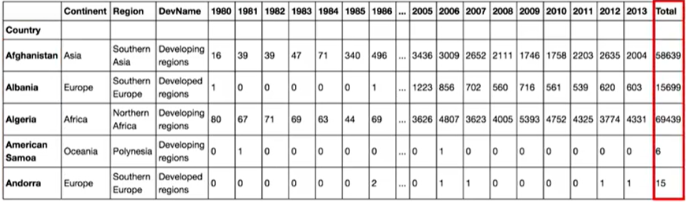
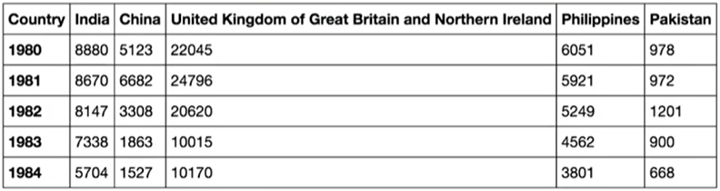

# Visualizacion de datos
### Tipo de gráficos:
1) Gráfico de área
2) Gráfico de histogramas
3) Gráficos de barras
4) Gráficos bar_chart

#### Gráfico de área:
Los gráficos de área se utilizan para mostrar el desarrollo de valores cuantitativos a lo largo de un intervalo o período de tiempo.
Ejemplo: 
importamos las librerías necesarias

    import matplotlib as mpl
    import matplotlib.pyplot as plt
    import numpy as np  # muy útil para cálculos científicos con Python
    import pandas as pd # Librería para estructar datos primarios
    
obtenemos el dataset deprueba (como se puede observar es de tipo excel):
    
    df_can = pd.read_excel('https://s3-api.us-geo.objectstorage.softlayer.net/cf-courses-   data/CognitiveClass/DV0101EN/labs/Data_Files/Canada.xlsx',
                       sheet_name='Canada by Citizenship',
                       skiprows=range(20),
                       skipfooter=2
                      )

    print('Data downloaded and read into a dataframe!')

Cambiamos los indices por country y añadimos la columna total:
    
    df_can.set_index('Country', inplace=True)
    df_can.head()

    df_can['Total'] = df_can.sum(axis=1)
    df_can.head()

# Generación de area plot
obtenemos la lista de años dese 1980 a 2014
     
     years = list(map(str,range(1980,2014)))
     
ordenadmos los datos de la columna total, sort_values()

    df_canada.sort_values(['Total'], ascending=False, axis=0, inplace=True)
    

    
obtenemos los cinco primeros valores, head()

    df_top5= df_canada.head()
    df_top5= df_top5[years].transpose()   #transponemos los datos de vertical a horizontal
    df_top5.plot(kind='area')  #le decimos que el gráfico a dibujar sea de tipo área
    
pintamos el gráfico y lo mostramos

    plt.title('top 5 paises con mayor imigración')
    plt.ylabel('Número de imigrantes')
    plt.xlabel('years')
  
    plt.show()
    

    

