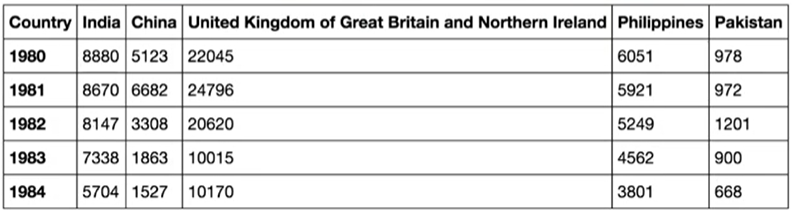

# Visualizacion de datos
### Tipo de gráficos:
1) Gráfico de área
2) Gráfico de histogramas
3) Gráficos de barras
4) Gráficos bar_chart

#### Gráfico de área:
Los gráficos de área se utilizan para mostrar el desarrollo de valores cuantitativos a lo largo de un intervalo o período de tiempo.
Ejemplo:
dataset deprueba en excel:

